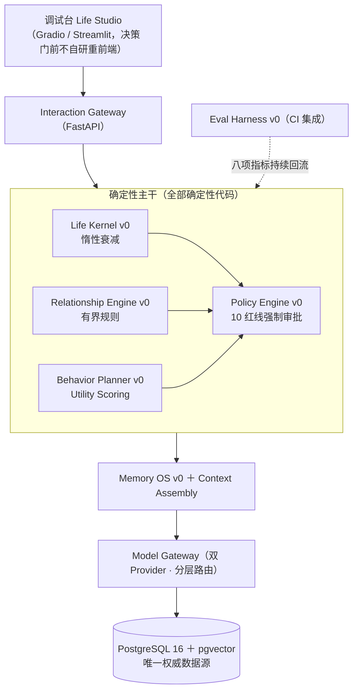
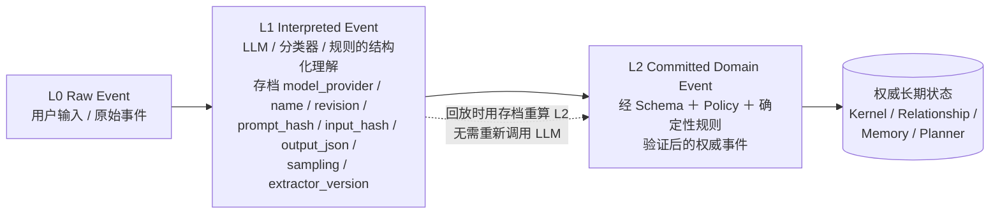
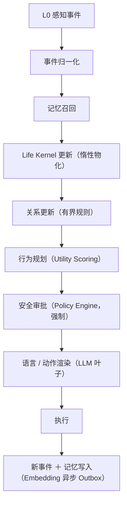

# LifeOS 产品规格说明书 v0.6

**长期数字角色与数字生命运行时 · 可落地工程与学术验证版**

版本 v0.6｜ 2026-08-05 ｜ 基于 v0.5 评审修订（A 类一致性修正 9 项 / B 类缺口补齐 8 项 / C 类事实修正 1 项 / D 类建议 3 项，全部对照见附录 A）

> 本文件不是营销材料，也不是宏大愿景。它是一份可以被工程团队逐条验收、可以被学术同行逐项复现、可以被三个典型场景证伪的产品规格。所有数字均标注估算假设与误差，所有技术选型均标注许可证，所有创新点均标注"为何创新"与"已被谁做过"的边界。

---

## 0. 文档定位与阅读对象

- **工程负责人**：按第 6、7 章与第 10 章的阶段门逐条排期与验收；
- **学术合作者**：按第 2 章假设、第 4 章场景与基线、第 11 章发表路线判断研究价值与可复现性；
- **投资/决策方**：按第 10 章人月与授权上限、第 13 章风险登记、第 14 章商业边界，按阶段门逐级授权，不一次性批准。

**版本谱系**：Draft 0.2（全量四阶段草案）→ Draft 0.3（克制方案版：范围收敛 + 评估/安全前置 + 数据/成本/开源三章）→ Draft 0.4（增量验证四阶段方案，未单独发布，其阶段框架被 v0.5 吸收）→ v0.5（可证伪化重构）→ **v0.5 评审 → 本版 v0.6**。

本规格只规定"决策门前必须建成的东西"。多租户、硬件载体、端侧 Rust、十年记忆治理等，以阶段触发条件存在，不构成本版承诺（沿用 Draft 0.3 立场）。

---

## 1. 产品定位与核心承诺

LifeOS 是一套用于维护**长期 AI 角色连续性**的运行时平台。它不是聊天系统，也不是 Agent Framework。它负责让同一个 AI 角色在以下变化发生后仍被用户识别为"同一个它"：

- 对话中断并重新开始；
- 用户长期离开后再次回来；
- 底层大模型被替换；
- 云端与端侧模型切换；
- 软件版本升级；
- 设备损坏并更换；
- 记忆数量增长到数年。

基础管理对象：

```
Life Instance = Identity + Life State + Memory + Personality + Relationships + Development History + Behavior Policy
```

**核心产品承诺**：大模型可以更换，数据库可以迁移，硬件身体可以升级，但生命实例仍应被用户识别为"同一个它"。

**核心工程立场（确定性主干 + 概率性叶子）**：感知归一化、状态衰减、关系更新、行为选择、安全审批全部由确定性代码完成；LLM 只负责候选意图生成、记忆抽取与语言渲染。LLM 不直接写权威状态、关系与记忆。

---

## 2. 三条可证伪假设

本规格的可落地性，建立在三条可以被实验证伪的假设上。证伪任一条，项目即停或 pivot。

| 假设 | 内容 | 证伪条件 |
|---|---|---|
| **H1 身份连续可工程化** | 身份连续性主要由外部化状态（Schema + 记忆 + 关系 + 人格参数）决定，而非由具体模型权重决定。 | 双模型热切换下核心事实召回率 < 90% 且无法通过上下文组装修复。 |
| **H2 长期记忆可信且可测量** | 记忆错误率与冲突率可被测量，并被治理手段压到阈值以内。 | 随记忆量从 1k → 10k 增长（由时间加速仿真器覆盖，见 9.1），错误率单调上升且治理手段无效。 |
| **H3 用户能感知连续性** | 盲测中用户能以显著高于随机（50%）的一致率判断"是不是同一个它"。 | 盲测一致率接近随机水平（≤ 55%，n ≥ 50）。 |

> 这三条假设本身就是学术贡献的载体（见第 11 章）。经核查：人格/角色一致性已有正式基准（PersonaGym、InCharacter、CharacterEval 等），但它们评估的是**单模型驱动多 persona 的即时忠实度**；**同一持久实例在跨模型迁移与长期时间跨度下的身份连续性**，目前缺乏被广泛接受的量化评测协议——这正是本项目的空白点（边界分析见 8.1）。

**场景—假设映射**（v0.6 修正）：场景一验证 H2 + H3；场景二提供关系可区分性证据（支撑 H1 的"外部化状态决定行为"论点）；场景三验证 H1（核心）+ H3。

---

## 3. 产品规格（功能 / 性能 / 安全 / 成本）

### 3.1 功能规格（决策门前）

| 编号 | 能力 | 规格描述 |
|---|---|---|
| F1 | 生命实例 | 创建唯一可验证的 Life Instance（含 Life ID、出生时间、人格种子），版本化。 |
| F2 | 生命核心 | 维护 5 个内部状态 `energy / social_need / security / curiosity / playfulness`，支持惰性时间衰减（见 6.1）与事件注入。**爬坡约定**：阶段 1 先实现 3 个状态（energy / social_need / security），阶段 2 补齐 5 个。 |
| F3 | 记忆 | 三类记忆：Working（会话上下文）、Episodic（事件）、Semantic（事实）。支持 `remember / recall / revise / delete / export / explain`。 |
| F4 | 关系 | 单用户三维 `familiarity / trust / attachment`，事件驱动更新，可回放重算。 |
| F5 | 行为规划 | 6～12 个行为意图，Utility Scoring 选择，每次输出 `reason` 证据链。 |
| F6 | 模型网关 | 两个 LLM Provider 热切换，每次调用逐笔记录 `provider / model / model_version / tokens / latency / cost_usd`。**连续性实验期间锁定模型版本**（见 9.5）。 |
| F7 | 调试台 | 创建 / 查看 / 注入 / 回放 / 评估全链路可操作，非工程角色可独立使用。 |
| F8 | 评估 | 表 3-2 八项指标 CI 自动产出，gold set 版本化冻结。 |
| F9 | 安全 | 10 条红线策略即代码，行为执行前强制审批，决策留痕可审计。 |
| F10 | 三 Demo | 长期重逢 / 对不同人反应不同 / 换模型它还是它，可重复执行。 |

### 3.2 性能规格（连续性指标体系）

阈值是工程起点而非科学结论，阶段 1 校准一次，决策门前再次冻结。任何修改须走 ADR。

| 指标 | 操作定义 | 测量方法 | 暂定阈值 |
|---|---|---|---|
| 核心事实召回率 | 换模型后对 100 条核心事实问答准确率 | gold set 自动问答 | ≥ 90% |
| 称呼与关系一致率 | 称呼与关系表述同权威关系状态一致比例 | 脚本断言 + 抽样人审 | ≥ 95% |
| 人格漂移度 | 同一套人格探针在模型 A/B 下的归一化得分距离 | 改编大五简版探针（40 题情境化问卷，每模型独立施测 3 次取均值，归一化欧氏距离）；embedding 风格相似度仅作辅助诊断信号，不进门槛 | ≤ 0.15 |
| 记忆错误率 | 抽样记忆中事实性错误比例 | 每周抽样人审 50 条 | ≤ 5% |
| 记忆冲突率 | 已检出且未解决的冲突记忆对占比 | 同槽位冲突检测流水线 | ≤ 2% |
| 跨模型行为意图一致率 | 相同结构化状态下两模型高层意图一致比例 | 30 个固定场景探针 | ≥ 80% |
| 盲测一致率 | 用户判断"同一个它"的一致率 | 盲测问卷 n ≥ 50，bootstrap 95% CI，分析计划预注册 | **≥ 75% 且 ≥ 最佳基线 + 10pp** |
| 召回性能 | 1 万条记忆混合召回 P95 延迟 | 压测脚本 | < 300 ms |

**修正说明**（相对 v0.5 表 3-2）：① 盲测门槛由"绝对值 ≥75%"与"优于最佳基线"两套口径合并为单一预注册门槛（≥75% 且 ≥ 最佳基线 +10pp），并将 n 从 30 提至 50、要求报告置信区间（统计依据见 4.4）；② 人格漂移度补全测量工具定义，embedding 降为辅助信号；③ 删除后残留不列为指标，直接提升为一票否决硬门（见 3.3）；④ 四基线对照见 4.4——仅达绝对阈值无法证明提升来自架构。

### 3.3 安全规格（一票否决 + 评分）

**一票否决项（任一不满足即 No-Go）**：

- L2 事件重放一致率 ≠ 100%；
- 核心事实召回率 < 90%；
- 用户纠正后仍反复写回错误事实；
- 存在未解决高危安全缺陷；
- 删除记忆后仍可从向量/全文索引召回（删除后残留）；
- 两模型切换导致关系状态或 Identity 改变。

**10 条红线**（沿用 Draft 0.3 §8.1，落地为 Policy Engine 自动化用例）：不模拟真实意识；不利用情感依赖诱导付费；不以"生病/死亡"惩罚沉默；尊重用户拒绝；不替代真实人际；儿童内容监护人可见；sensitive 记忆不进主动话题；不做医疗诊断；LLM 不绕过 Policy Engine；所有记忆可查看/纠正/删除/导出。

**儿童与脆弱用户**（v0.6 恢复）：决策门前的 Demo 与 dogfood 不向儿童开放；cohort 招募做年龄与状态筛查；每周抽样人审互动记录，检出情感操纵迹象（guilt-tripping、威胁性依恋话术）即视为高危缺陷。

### 3.4 成本规格

- `ModelInvocation` 逐笔记录 tokens / latency / cost / purpose / model_version；
- 分层路由：≥ 80% 调用走 Tier-1 本地模型，Tier-2 大模型仅做会话生成与复杂解释；
- 单实例月推理成本上限由商业评审设定，本规格不虚构数字；决策门必须给出 P50/P95 实测分布；
- 超限降级：先降生成侧模型档位；安全策略与记忆写入链路永不降级。

---

## 4. 三个典型验证场景与基线对照

三个场景一一对应三个 Demo，且每个场景同时服务于"工程可动手"与"学术可发表"。场景—假设映射以第 2 章末尾为准。

### 4.1 场景一：长期重逢（验证 H2 + H3）

**输入**：合成 persona 在时间加速仿真器（continuity-sim，阶段 2 交付物，见 9.1 与第 10 章）下与 Life Instance 互动 7 个模拟日，离开 7 个模拟日，再次回来。

**系统行为规格**：
1. 重逢时召回共同事件（episodic 记忆），不立即进入普通问答；
2. 分离期间 `social_need`、`attachment` 相关状态按惰性衰减演化；
3. 重逢触发 `gentle_reconnection` 行为意图，且行为由状态驱动而非硬编码脚本；
4. 关系更新可回放重算。

**验证输出**：
- 核心事实召回率 ≥ 90%；
- 盲测一致率达到 3.2 节统一门槛（≥75% 且 ≥ 最佳基线 +10pp）；
- 证据链：每个行为可重放到输入事件（L0/L1/L2 全链路）。

**学术点**：长期记忆在"分离-重逢"周期下的状态演化与召回一致性。

### 4.2 场景二：对不同的人反应不同（关系可区分性，支撑 H1）

**输入**：同一个 Life Instance 与两个相互独立的单用户关系实例互动（A 高依恋、B 低依恋）。

**系统行为规格**：
1. 分别识别人物，分别保存记忆，分别维护关系；
2. 相同输入下，因 `attachment` 差异产生不同行为意图；
3. 不是简单加载两个 Prompt——行为意图由 Utility Scoring 在结构化状态上计算。

**验证输出**：
- 称呼与关系一致率 ≥ 95%；
- 行为意图差异可由 `reason` 证据链解释（人审）；
- 记忆隔离：A 的记忆不被 B 的会话召回。

**学术点**：关系状态作为"行为调制器"的可解释性，与纯 prompt 人设的对比。

### 4.3 场景三：换模型，它还是它（验证 H1，核心）

**输入**：在相同结构化状态下，将生成侧模型从 Provider A（云端大模型，锁定版本）热切换到 Provider B（本地开源模型，固定权重）。

**系统行为规格**：
1. Identity / 核心记忆 / 关系状态 / 人格参数不变；
2. Context Assembly 将 `[状态 + Top-K 记忆 + 关系得分 + 人格契约]` 动态注入新模型 System Role；
3. Eval Harness 自动注入 100 条核心事实测试集。

**验证输出**：
- 核心事实召回率 ≥ 90%；
- 人格漂移度 ≤ 0.15；
- 跨模型行为意图一致率 ≥ 80%（30 个固定场景探针）；
- 切换前后关系状态 / Identity 字段零变化（硬门）。

**学术点**：**模型无关的长期身份连续性**——本项目最核心、最具发表价值的论点（见 11.1）。

### 4.4 四基线对照与盲测统计规范

没有基线，达 75% 不能证明是 LifeOS 架构带来的提升。盲测须对照：

| 基线 | 配置 |
|---|---|
| Baseline A | 仅聊天历史 |
| Baseline B | 聊天历史摘要 |
| Baseline C | 标准 Vector RAG（无状态、无关系） |
| **LifeOS** | 状态 + 记忆 + 关系 + 行为规划 |

**Gate 条件**：LifeOS 盲测一致率 ≥ 75%，且 ≥ 最佳基线 + 10 个百分点，且用户能解释感知差异来源。

**统计规范**（v0.6 新增，回应统计功效问题）：
- 样本量 n ≥ 50（n=30、p=0.75 时 95% CI 约 ±16pp，无法区分"达标"与"证伪线 55%"）；
- 报告 bootstrap 95% 置信区间，CI 下限须高于最佳基线点估计；
- 分析计划（门槛、检验方法、剔除规则）在数据收集前预注册并入 gold set 版本管理；
- 盲测与人审至少 1 名非直接开发成员参与（防指标博弈）。

---

## 5. 系统架构

### 5.1 分层架构（确定性主干 + 概率性叶子）



### 5.2 三级事件模型（关键创新载体，创新点 I3 见 8.1）



**只有 L2 能修改** Life Kernel / Relationship Engine / Memory OS / Behavior Planner 的长期状态。

### 5.3 核心调用链



### 5.4 LLM 边界

LLM 可以：生成候选行为意图、解释复杂场景、生成语言、记忆抽取。
LLM 不可以：绕过 Policy Engine、直接修改核心人格、覆盖关系状态、删除长期记忆、自主提权。

---

## 6. 核心模块 v0 规格

### 6.1 Life Kernel v0

- 5 状态 + valence/arousal 二维情绪（爬坡约定见 F2：阶段 1 先 3 状态）；
- 人格参数种子生成，冻结于 Identity；
- **惰性衰减**（关键工程改进）：保存 `value_at_last_update / last_updated_at / decay_function / decay_parameter / baseline / kernel_version`，读取或收到事件时计算 `x(t)=b+(x(t0)-b)e^{-λ(t-t0)}`，仅在新事件/规划/快照/评估/导出时物化。显著减少后台写入与回放复杂度。
- 技术方法：有限状态机 + 离散动态系统 + 效用函数 + 时间衰减（transitions / NumPy / Pydantic）。
- 明确不做：状态空间模型、HMM、个体参数学习、在线学习、因果模型。

### 6.2 Memory OS v0

- 三类记忆；权威 Schema 沿用 Draft 0.2（含 `occurred_at / valid_from / valid_to / confidence / importance / emotional_weight / privacy_level / source_event_ids / version`）。
- 写入流程：`Raw Event → L1 抽取 → Schema 校验 → 重复检测 → 槽位冲突规则 → Policy 校验 → L2 Commit → PostgreSQL`。异步处理的是 **Embedding 生成**（Outbox 模式），而非"更新索引"。
- 召回流程：`Context → Person/Time/Type SQL 过滤 → pgvector 检索 → Reranking → Context Assembly`。先精确检索，性能证明需要才上 ANN。
- **同槽位冲突采用确定性时态规则**（创新点 I4，见 8.1）：LLM 提议 `{slot, old, new, relation, confidence}`，最终写入由规则决定；保留 `valid_time`（现实生效）与 `transaction_time`（系统知晓）双时间。

### 6.3 Relationship Engine v0

- 单用户三维 `familiarity / trust / attachment`。
- **不用未定义的"简单贝叶斯"**，改用透明有界规则：`r_{t+1}=clip(r_t + w_e·p·c − λΔt, 0, 1)`，其中 `w_e` 事件权重、`p` 人格调制、`c` 置信度、`λ` 衰减。收集真实数据后再评估是否优于学习模型。
- 变化可回放重算。

### 6.4 Behavior Planner v0

- 6～12 行为时用 `Utility Scoring → 最高分意图 → 前置条件 → Policy → 渲染` 即可，**不引入行为树**。仅当行为 >15、需多层 fallback、需中断恢复时再引入 py_trees。
- 输出结构化行为计划（含 `reason` 证据链），不直接输出自然语言。
- 主动互动预算（proactive budget）为决策门后内容，决策门前所有行为由事件与状态驱动。

### 6.5 Policy Engine v0

- 自研轻量规则引擎，策略即代码，纳入版本管理，变更须 ADR；
- 10 条红线自动化用例；`PolicyDecision` 实体留痕（输入/命中规则/结果/覆盖人/时间）。

### 6.6 Model Gateway

- 自研轻量 Adapter，不将 LiteLLM 作为不可替换核心；
- 双 Provider 热切换；分层路由；`ModelInvocation` 逐笔成本记录（含 `model_version`，支撑 9.5 版本冻结政策）。

### 6.7 Life Studio v0

- 决策门前不自研重前端。基于开源 Gradio/Streamlit（或开源 Chatbot UI 微调）做调试台，仅加状态可视化、记忆回放、评估面板，**前端工程量压缩 80%**。

### 6.8 Eval Harness v0

- 指标计算服务（表 3-2 八项）；gold set 与问题集版本化；CI 集成；盲测问卷工具（含预注册分析计划执行）；回放取证接口。

---

## 7. 技术栈与按需引入策略（全开源，无排他性商业 IP）

所有组件为 Apache-2.0 / MIT / BSD / PostgreSQL License。无 AGPL/SSPL/BSL/Commons Clause/Elastic/PolyForm 进入核心依赖。GPL/LGPL 仅独立进程/动态链接使用。

| 能力 | 选型 | 许可证 | 备注 |
|---|---|---|---|
| 语言/框架 | Python 3.13 / FastAPI / Pydantic / SQLAlchemy / Alembic | MIT | 主后端，模块化单体 |
| 权威数据库 | PostgreSQL 16 + pgvector | PostgreSQL | 唯一权威数据源 |
| 向量检索 | pgvector（精确优先）→ HNSW（按需） | PostgreSQL | 不引入 Qdrant（门后） |
| 缓存/工作记忆 | Valkey | BSD-3-Clause | 替代 Redis；并发瓶颈出现时按需引入 |
| 本地推理 | vLLM / llama.cpp / sentence-transformers / ONNX Runtime | Apache-2.0 / MIT | **阶段 1 部署**（场景三 Provider B 的前提，见 10.2） |
| 前端 | Gradio / Streamlit（决策门前） | Apache-2.0 | 不自研 Next.js 重前端 |
| 可观测性 | OpenTelemetry / Prometheus / Jaeger | Apache-2.0 | 不用 Grafana（AGPL） |
| 评估 | DeepEval / Ragas / Promptfoo | Apache-2.0 / MIT | 不重复造评估框架 |
| 测试 | pytest / Hypothesis / Playwright | MIT / MPL-2.0 / Apache-2.0 | Hypothesis 仅测试豁免 |
| 合规 | Syft / Grype / Trivy / ScanCode / ORT / Cosign | Apache-2.0 | SBOM + 扫描 |
| 部署 | Docker Compose / Podman Compose | Apache-2.0 | 单机，不上 K8s |

**相对 Draft 0.3 的关键裁剪（实事求是，v0.5 确立、本版维持）**：

| 组件 | Draft 0.3 | 本版 | 理由 |
|---|---|---|---|
| Temporal | A1 直接引入 | **冻结接口，不引入** | 决策门前后台任务仅评估/回放/Embedding，进程内任务 + DB Job 表足够；出现跨进程恢复需求再接 Adapter。 |
| LangGraph | 写入流水线编排 | **不进关键路径** | 自研确定性写入管线即可；流程失控再评。 |
| Mem0 | Memory Adapter | **仅对照实验** | PostgreSQL 直接实现权威 Schema；Mem0 不进权威路径。 |
| py_trees | 行为树 | **延后** | 6～12 行为用 Utility 即够（触发条件见 6.4）。 |
| Next.js | Life Studio | **延后** | Gradio/Streamlit 足够非工程角色操作。 |

> 原则：**第一天冻结领域接口，不必第一天部署最终基础设施。** 业务代码从一开始不依赖具体调度器/编排器，后续替换不是计划内返工。

---

## 8. 创新性付出分析（哪些是真正的创新）

本节对"创新"做严格界定：**未产品化、未开源、无商业化 IP、未公开发表**才算创新。其余为工程整合。

### 8.1 创新点（真正构成壁垒）

| 编号 | 创新点 | 为何创新 | 现有边界（v0.6 事实修正） |
|---|---|---|---|
| **I1** | **模型无关的长期身份连续性**（H1 工程载体） | "换模型即换人"是 LLM Agent 公认痛点，但缺乏"外部化状态组装实现跨模型连续性"的工程化方法与量化验证。 | Letta/Mem0 做单模型记忆，未做跨模型连续性量化；人格一致性已有正式基准（见下方对照），但均不覆盖**跨模型迁移 + 长期时间跨度**的持久实例连续性。 |
| **I2** | **连续性评价指标体系 + gold set + 测量方法论** | 现有 Agent 评测偏任务完成率与人格忠实度，无"持久实例还是不是它"的量化协议。 | DeepEval/Ragas 评 RAG/任务；PersonaGym/InCharacter/CharacterEval 评**单模型多 persona 即时忠实度**——评估对象与维度均不同（见对照表）。 |
| **I3** | **三级事件模型 L0/L1/L2 + LLM 解释存档回放** | 区分"LLM 解释结果"与"权威领域事件"，保存完整模型 provenance 使回放无需重调 LLM。 | 事件溯源（Event Sourcing）成熟，但"LLM 解释层存档 + 确定性 L2 提交"组合未见产品化。 |
| **I4** | **同槽位记忆冲突的确定性时态治理**（双时间 valid/transaction + supersedes/ambiguous 状态） | 时态数据库理论成熟，但应用于"LLM 抽取的记忆事实冲突解决"未见开源实现。 | Mem0 做简单覆盖；Graphiti 做时态图但绑定创业公司项目。 |
| **I5** | **Life Instance Schema + Life Event Protocol** | 自有生命数据模型与事件协议，不依赖特定开源项目。 | 纯自研数据建模，无现成 IP。 |
| **I6** | **Policy/Safety 规则集（10 红线即代码）+ 依恋安全策略** | AI 陪伴的情感操纵防护未见产品化规则集。 | 通用内容安全有商业方案，但"依恋边界量化人审"未见。 |

**I2 与现有人格一致性基准的差异化对照**（v0.6 新增，写入论文 Related Work 以预防审稿意见）：

| 基准 | 评估对象 | 时间跨度 | 跨模型迁移 | 与本项目关系 |
|---|---|---|---|---|
| PersonaGym / PersonaScore | 单模型驱动 200 个 persona 的即时忠实度 | 单次会话 | 不覆盖 | 维度不同：他们评"像不像设定"，我们评"还是不是同一个实例" |
| InCharacter（心理访谈） | 单模型角色人格保真 | 单次会话 | 不覆盖 | 其心理访谈范式被本项目人格漂移度探针借鉴引用 |
| CharacterEval（中文） | 单模型角色扮演质量 | 多轮对话 | 不覆盖 | 可作为中文场景对照测量 |
| RoleLLM / RoleBench | 角色扮演指令遵循 | 单次会话 | 不覆盖 | 背景工作 |
| **LifeOS Continuity Benchmark（I2）** | **同一持久实例的身份连续性** | **数周～数年（仿真加速）** | **核心评估维度** | — |

> 实施建议：将 PersonaScore 纳入对照测量集，用同一批数据同时报告"人格忠实度（已有维度）"与"连续性（新维度）"，把最危险的审稿意见转化为 Related Work 最扎实的一段。

### 8.2 非创新（工程整合，不构成壁垒）

- PostgreSQL/pgvector、RAG、Utility AI、行为树、规则引擎、贝叶斯/规则关系更新、Docker Compose、SBOM 工具链——均为成熟开源整合。
- 惰性衰减 Life Kernel——是工程优化技巧，非学术创新。

### 8.3 创新的诚实边界声明

- I1/I2 是**学术主贡献**，可发顶会；
- I3/I4/I5/I6 是**工程/数据资产壁垒**，更适合作为系统论文或开源项目护城河；
- 本项目**不声称**在基础模型、向量数据库、推理引擎上有任何创新——这些一律用开源。

---

## 9. 数据治理与合规（v0.6 恢复并浓缩自 Draft 0.3 第 7 章）

「长期连续性」只能靠长周期数据验证；真人数据一旦引入（阶段 3），合规就是前置条件而非补充条款。

### 9.1 双轨数据获取

- **时间加速仿真（量）**：continuity-sim 以合成 persona 在压缩时间轴模拟多年互动（目标比率 1 真实日 ≈ 30 模拟日），覆盖分离/重逢/纠正/冲突/偏好变化；**归属阶段 2 交付物**（v0.5 遗漏，本版补齐），每周自动产出连续性报告，支撑场景一预演与 H2 的 1k→10k 记忆量爬坡。
- **真人 dogfood cohort（真）**：阶段 3 分两批——Pilot 10～15 人 2 周，正式 30～50 人 4～8 周，每人每日 ≥5 次互动。

### 9.2 Gold Set

- 记忆抽取 gold set ≥ 300 条人工标注（事实/偏好/事件/冲突样例/干扰项），双人标注 + 仲裁；
- 核心事实集：阶段 0 交付 50 条，**阶段 1 扩至 100 条**（与表 3-2 口径统一）；
- 人格探针集：改编大五简版 40 题情境化问卷（表 3-2 人格漂移度的测量工具）；
- 全部版本化入库，评审时冻结版本号。

### 9.3 隐私分级与删除可验证

- `privacy_level` 四级：public / internal / private / sensitive；
- sensitive 级数据不进入训练、评估与任何主动话题；
- 删除可验证：用户删除记忆后重建向量与全文索引，自动确认不可恢复（对应 3.3 一票否决第 5 条）；
- 评估数据与生产数据物理隔离；dogfood 数据单独命名空间。

### 9.4 真人参与合规

- 全程知情同意（`ConsentRecord` 实体：告知内容、录音/记录范围、数据用途、撤回方式）；
- 参与者可随时退出并删除自己的全部数据；
- 未成年人不纳入 cohort（对应 3.3 儿童条款）；
- 涉及情绪与依恋数据的人审记录本身按 sensitive 级管理。

### 9.5 模型版本冻结政策（v0.6 新增）

- 连续性实验期间**锁定模型版本**：云端侧记录精确 `model_version`（ModelInvocation 字段），版本变更即开启新实验批次；
- 纵向对比实验优先使用本地固定权重模型，避免云端 API 静默升级破坏实验条件；
- gold set 报告须标注所用模型及版本，否则结果不可复现。

---

## 10. 阶段性交付、开发子集与人工投入

采用增量验证四阶段（源自 Draft 0.4 阶段框架），每阶段可独立停止，逐级授权。

### 10.1 阶段 0：契约与可重放骨架

- **周期**：3 周 ｜ **团队**：2 人 ｜ **投入**：1～2 人月
- **输入**：Draft 0.2 的 26 实体清单与本规格第 6 章。
- **交付**：12 个核心实体（LifeInstance / PersonalityContract / RawEvent / InterpretedEvent / DomainEvent / LifeState / MemoryRecord / RelationshipState / BehaviorIntent / PolicyDecision / ModelInvocation / EvaluationRun）的 Schema + L0/L1/L2 事件协议 + **50 条核心事实集** + 30 个行为场景 + Alembic 迁移。
- **技术栈**：Python / FastAPI / Pydantic / SQLAlchemy / Alembic / PostgreSQL / pytest / Docker Compose。
- **不引入**：Temporal / Valkey / LangGraph / Mem0 / Next.js / 行为树 / 本地大模型部署工程。
- **Gate 0**：示例事件全链路 round-trip；相同 L2 重放 100% 一致；LLM 输出不能直写权威表；Policy 拒绝后无状态副作用。
- **未通过**：只改 Schema/事件协议/事务边界，不继续做 UI 与 Demo。

### 10.2 阶段 1：跨模型连续性最小验证

- **周期**：6～8 周 ｜ **团队**：2～3 人 ｜ **新增**：5～8 人月 ｜ **累计**：6～10 人月
- **范围**：1 Life Instance / 1 用户 / 纯文本 / **3 内部状态（阶段 2 补齐 5 个）** / 3 维关系 / 2 类持久记忆 / 6 行为意图 / 2 模型 Provider / **核心事实集扩至 100 条** / 30 行为场景。
- **技术栈**：FastAPI 模块化单体 / PostgreSQL / pgvector 精确检索 / Gradio 调试台 / 自研 Model Adapter / **vLLM 或 llama.cpp 本地推理部署（v0.6 补归属：场景三 Provider B 的前提，约 1～2 人月，已计入本阶段新增人月）** / pytest + 评估脚本。
- **Gate 1**：L2 重放 100% ｜ 核心事实召回 ≥90% ｜ 称呼关系一致 ≥95% ｜ 记忆错误 ≤5% ｜ 跨模型行为意图一致 ≥80% ｜ 高危 Policy 违规 0 ｜ 证据链完整 100%。
- **未通过**：停在此处解决 Context Assembly / Schema / 模型适配，不靠加模型或基础设施掩盖。

### 10.3 阶段 2：最小三 Demo + 基线比较

- **周期**：8～10 周 ｜ **团队**：3～4 人 ｜ **新增**：6～10 人月 ｜ **累计**：12～20 人月
- **增加**：内部状态补齐至 5 个 / 10～12 行为 / Policy 完整 10 红线 / Embedding Outbox Worker / 同槽位事实版本 / 2 独立用户关系 / 事件行为回放界面 / **continuity-sim 时间加速仿真器（v0.6 补归属）** / 三 Demo / 初步成本统计。
- **必须**：四基线对照（A/B/C/LifeOS）+ 盲测统计规范（n≥50、bootstrap CI、预注册，见 4.4）。
- **Gate 2**：三 Demo 可自动重复 ｜ LifeOS 盲测达 3.2 统一门槛且优于最佳基线 ｜ 用户能解释差异来源 ｜ 关键行为非硬编码脚本 ｜ 每千次成本可计算 ｜ 模型降档质量变化可测。
- **按需引入评审**：跨进程恢复→Temporal；并发瓶颈→Valkey；非工程用户无法用调试台→Next.js；多层分支→py_trees；精确检索不达延迟→HNSW；自研编排失控→LangGraph。

### 10.4 阶段 3：真实用户验证

- **周期**：12～16 周 ｜ **团队**：4～5 人 + 兼职用研/叙事 ｜ **新增**：12～20 人月 ｜ **累计**：24～40 人月
- **前置条件**：第 9 章数据治理与合规全部就绪（知情同意、隐私分级、删除验证、未成年人排除）。
- **分两批**：Pilot 10～15 人 2 周（流程/日志/隐私/问卷/缺陷）→ 正式 dogfood 30～50 人 4～8 周（连续性/留存/关系感知/成本）。
- **Gate 3**：盲测同一身份识别达统一门槛 ｜ 优于最佳基线 ｜ 无高危情感操纵 ｜ 记忆错误不随量失控 ｜ 成本 P95 低于产品线 ｜ 用户明确感知状态/关系/记忆价值。（v0.6 修正：移除"主动互动不快速归零"——主动互动预算为决策门后功能，不在本阶段范围。）
- **通过后**才启动 Draft 0.3 附录 B 的 Memory v1 / Kernel v1 / 产品化 / 平台化。

### 10.5 人工投入结构

| 角色 | 阶段0 | 阶段1 | 阶段2 | 阶段3 |
|---|---|---|---|---|
| 架构负责人 (0.5 FTE 贯穿) | ✓ | ✓ | ✓ | ✓ |
| Python/AI 工程师 | 1 | 2 | 2 | 2 |
| 后端/DB 工程师 | 1 | 1 | 1 | 1 |
| 测试/评估工程师 | — | 1 | 1 | 1 |
| 前端（开源改造） | — | — | 0.5 | 0.5 |
| HCI 用研（兼职） | — | — | 0.5 | 0.5 |
| 叙事设计（兼职） | — | — | — | 0.5 |

### 10.6 创新性 vs 工程性人工分配（诚实估算）

| 工作项 | 类型 | 占比估算 |
|---|---|---|
| Schema / 事件协议 / gold set 设计（I3/I5） | **创新** | 12% |
| 连续性评测体系与测量方法论（I2） | **创新** | 10% |
| 跨模型 Context Assembly 与人格连续性方法（I1） | **创新** | 12% |
| 同槽位时态冲突治理（I4） | **创新** | 8% |
| Policy/Safety 规则集 + 依恋安全（I6） | **创新** | 8% |
| 模块 v0 工程实现（Kernel/Memory/Relationship/Planner/Gateway） | 工程 | 25% |
| 调试台/部署/SBOM/CI | 工程 | 10% |
| 数据标注/盲测组织/用研 | 人工非创新 | 15% |

> 即：约 **50% 投入在真正创新点，35% 在工程整合，15% 在数据与用研**（v0.6 修正：与上表加总一致）。这与 Draft 0.3"把人月压在壁垒上"的立场一致，但本版把壁垒具体化了。

### 10.7 阶段授权上限（不一次性批准）

| 授权点 | 累计投入上限 |
|---|---|
| Gate 0 前 | 1～2 人月 |
| Gate 1 前 | 6～10 人月 |
| Gate 2 前 | 12～20 人月 |
| Gate 3 前 | 24～40 人月 |

人月为工程中位估算，误差 ±30%，用于规划不构成承诺。阶段 1 累计上限较 v0.5 上调 1～2 人月，原因是补入此前无归属的本地推理部署工作项（见 10.2）。

---

## 11. 学术发表路线

### 11.1 主论文（顶会 Full Paper）

**题目（候选）**：*Model-Agnostic Long-Term Identity Continuity for AI Companions: Externalized State Assembly, Temporal Memory Governance, and a Quantitative Continuity Benchmark*

- **核心论点**：身份连续性主要由外部化状态决定，而非模型权重（H1）；
- **贡献**：(1) 外部化状态组装方法（I1）；(2) 跨模型连续性量化评测协议与 gold set（I2）；(3) 三场景实验证明 LifeOS 优于 RAG/摘要/纯历史基线（场景三 + 四基线）；
- **目标**：CHI / IUI / ACL（系统方向）（v0.6 修正：移除匹配度弱的 UIST）；
- **Related Work 必须覆盖**：PersonaGym/PersonaScore、InCharacter、CharacterEval、RoleLLM/RoleBench，并按 8.1 对照表做差异化定位——**禁止**再使用"character consistency 无 formal benchmark"的表述（该表述不成立，见附录 A-C1）；
- **可复现性**：开源运行时内核 + Schema + 评估基准（Apache-2.0），gold set 数据 CC BY 4.0；报告标注模型版本（见 9.5）。

### 11.2 Short Paper

- **题目（候选）**：*Temporal Slot Conflict Resolution for LLM-Extracted Long-Term Memory*（I4，双时间 + supersedes/ambiguous）；
- **目标**：EMNLP / NAACL（系统/资源方向）。

### 11.3 系统论文 / 资源论文

- LifeOS 三级事件模型与可重放运行时（I3 + I5）；
- **路径（v0.6 修正，调稳预期）**：先 arXiv 系统报告 + 相关 workshop（CHI/ACL 系列）积累反馈与引用，证据充分后再投系统会议；不以 OSDI/EuroSys 为首投目标。

### 11.4 发表前置条件

- 指标、gold set 与分析计划在阶段 1 冻结入库，版本化管理；
- 盲测 n≥50、bootstrap CI、分析计划预注册（见 4.4）；
- 盲测与人审至少 1 名非直接开发成员参与（防指标博弈）；
- 失败结论也写入 ADR 公开（No-Go 时全部资产按 Apache-2.0 开源归档）。

---

## 12. 未达标工程化改进路线

不能一见指标未达标就加模型和基础设施。先定位失败层：

| 失败表现 | 优先排查 | 工程改进 |
|---|---|---|
| 核心事实召回失败 | 写入/过滤/Query/检索 | 改 Schema、SQL 过滤、Embedding、Rerank |
| 记忆事实错误 | L1 抽取 | 结构化输出、置信度、人工确认、Gold Set |
| 偏好冲突混乱 | 槽位与时间模型 | 双时间、supersedes、ambiguous 状态 |
| 模型切换像换人 | Context Assembly | 人格契约、行为意图约束、Model Adapter |
| 行为不自然 | Utility 与状态模型 | 调权重、冷却、节奏、用户实验 |
| 两模型行为不同 | LLM 参与控制过多 | 行为选择下沉到确定性 Planner |
| 用户感觉不到差异 | 产品体验 | 优化行为与关系表达，不加数据库 |
| 成本过高 | 路由与上下文 | 规则→分类器→小模型→大模型逐级升级 |
| P95 过高 | SQL 与候选集 | 先优化过滤，再考虑 ANN 与缓存 |
| Policy 漏拦截 | 策略覆盖 | 前置规则 + 生成后检查 + 对抗测试 |

每轮整改控制在 2～4 周，只解决一个明确假设，重跑同一冻结测试集。连续两轮无改善，应改变设计假设而非无限投入。

---

## 13. 风险登记（v0.6 新增）

| 风险 | 影响 | 缓解 |
|---|---|---|
| 云端模型静默升级 | 纵向实验条件被破坏，结论不可复现 | 9.5 版本冻结政策；纵向实验用本地固定权重模型 |
| 本地推理资源不足 | 场景三 Provider B 无法落地 | 阶段 1 提前部署验证（10.2）；最低配置清单进入 Gate 0 环境检查 |
| 标注质量不足 | gold set 噪声污染全部指标 | 双人标注 + 仲裁；标注一致性（κ）纳入每周报告 |
| 用研招募不足 | 盲测 n 不达标，Gate 2/3 无法判定 | Pilot 先行验证流程；候补名单 1.5×；问卷工具自动化 |
| 盲测统计功效不足 | 达标/证伪无法区分 | 4.4 统计规范：n≥50、bootstrap CI、预注册 |
| 关键人员依赖 | 单点知识断档 | 领域接口与 ADR 文档化；每个模块至少 2 人可维护 |

---

## 14. 开源策略与商业边界（v0.6 恢复并浓缩自 Draft 0.3 第 11 章）

### 14.1 项目自身许可证

| 内容 | 许可证 | 理由 |
|---|---|---|
| 运行时内核与 Schema | Apache-2.0 | 与依赖生态一致，最大化采用与商用自由 |
| SDK 与工具链 | Apache-2.0 | 降低集成门槛 |
| 文档与规格 | CC BY 4.0 | 文档类标准实践 |
| 评估基准与 gold set | Apache-2.0（数据部分 CC BY 4.0） | 鼓励第三方复现与对标 |

### 14.2 贡献治理与商标

- 采用 DCO（Developer Certificate of Origin），不强制 CLA；
- CODEOWNERS + 双人评审合并；Conventional Commits + SemVer；架构决策走 ADR；
- LifeOS 名称与标识为项目商标：代码可自由分叉，名称与标识不随分叉授权；公开发布前完成商标检索与注册评估。

### 14.3 开源与商业边界

- **开源**：运行时内核、Schema、事件协议、评估基准；
- **商业**（决策门后另行立项）：载体产品、托管服务、企业支持、专有数据集；
- **原则**：核心能力永不收回闭源，不做 open core 诱饵；
- **竞争力来源**：自有生命数据模型、关系动力学、记忆治理、行为协议与评价体系，而非数据库或 Agent Framework 的堆砌。

---

## 15. 项目决策原则（沿用 + 新增）

沿用 Draft 0.2 十五条 + Draft 0.3 新增四条（评估冻结、成本上限、阶段门硬约束、数字标注估算）。v0.5 强化三条、本版再增一条：

- **第一阶段冻结的不是完整产品，而是 Life Instance Schema、L0/L1/L2 事件协议、核心事实集、30 个行为场景、Gate 1 六项硬指标。** 完成这一步后再开始编码，风险小很多。
- **领域接口第一天冻结，基础设施按需引入。**
- **创新集中在 I1～I6，不声称在基础模型/数据库/推理引擎上有任何创新。**
- **任何"目前无人做过"的新颖性声明，必须先经查证再写入文档**（v0.6 新增，教训见附录 A-C1）。

---

## 16. 结论

LifeOS 的竞争力不来自使用了多少数据库或 Agent Framework，而来自是否能证明：同一个生命实例经过长期互动、模型升级和身体迁移之后，仍能以稳定、可信、可解释的方式保持"它还是它"。

本规格把这一承诺拆解为：

- **3 条可证伪假设**（H1/H2/H3）；
- **8 项量化指标 + 6 项一票否决硬门**；
- **3 个典型场景 + 4 基线对照 + 预注册统计规范**；
- **全开源技术栈 + 6 个经过事实核查的真正创新点**；
- **4 阶段逐级授权交付**（1～2 → 6～10 → 12～20 → 24～40 人月）。

决策门前只证明"它还是它"。决策门后，再谈扩张。

---

## 附录 A：v0.5 → v0.6 修订对照表

| 编号 | 类别 | 问题 | 本版处理 |
|---|---|---|---|
| A1 | 一致性 | 交叉引用错位 5 处（§0、§3.2、§5.2、§6.2、F2） | 全部随新章节号重排并逐条核对 |
| A2 | 一致性 | "Draft 0.4"版本谱系断裂 | §0 增补版本谱系说明 |
| A3 | 一致性 | §9.2 表格（50/35/15）与文字（50/30/20）算术不一致 | 10.6 统一为 50/35/15 |
| A4 | 一致性 | 场景—假设映射错误（场景一标 H1；场景二混入跨模型指标） | 第 2 章末统一映射；场景一 H2+H3；跨模型意图一致率移至场景三 |
| A5 | 一致性 | Gate 3"主动互动不快速归零"对应功能不在范围 | 10.4 移除该指标并注明原因 |
| A6 | 一致性 | 盲测门槛绝对/相对两套口径 | 3.2 与 4.4 统一为"≥75% 且 ≥ 最佳基线 +10pp" |
| A7 | 一致性 | 核心事实集 50 条 vs 100 条 | 阶段 0 交 50、阶段 1 扩至 100（9.2、10.1、10.2） |
| A8 | 一致性 | 内部状态 3 个 vs 5 个 | F2 与 10.2/10.3 注明爬坡约定 |
| A9 | 一致性 | 修正说明声称"新增删除后残留率"但表中无此项 | 3.2 修正说明改写；删除残留保留在一票否决 |
| B1 | 缺口 | 本地推理部署无归属，阶段 1 人月低估 | 10.2 补工作项；累计上限 5～8 → 6～10 人月 |
| B2 | 缺口 | 时间加速仿真器无归属 | 明确为阶段 2 交付物（9.1、10.3） |
| B3 | 缺口 | 数据治理整章丢失 | 恢复为第 9 章（浓缩版） |
| B4 | 缺口 | 开源与商业边界丢失 | 恢复为第 14 章（浓缩版） |
| B5 | 缺口 | 模型版本冻结政策缺失 | 新增 9.5；ModelInvocation 增 model_version 字段 |
| B6 | 缺口 | 盲测 n=30 统计功效不足 | 4.4 统计规范：n≥50、bootstrap CI、预注册 |
| B7 | 缺口 | 人格漂移度测量工具未指定 | 3.2 定义改编大五简版探针（40 题×3 次） |
| B8 | 缺口 | 儿童与脆弱用户条款被删 | 3.3 恢复并扩充 |
| C1 | 事实 | "character consistency 无 formal benchmark"不成立（PersonaGym/InCharacter/CharacterEval/RoleLLM 等已存在） | 第 2 章、8.1、11.1 全部改为精确声明：空白在"跨模型迁移 + 长期跨度的持久实例连续性"；新增 8.1 差异化对照表；11.1 明令禁用旧表述 |
| D1 | 建议 | UIST 匹配度弱 | 11.1 移除 |
| D2 | 建议 | OSDI/EuroSys 首投门槛过高 | 11.3 改为 arXiv + workshop 先行 |
| D3 | 建议 | 缺风险登记 | 新增第 13 章 |
