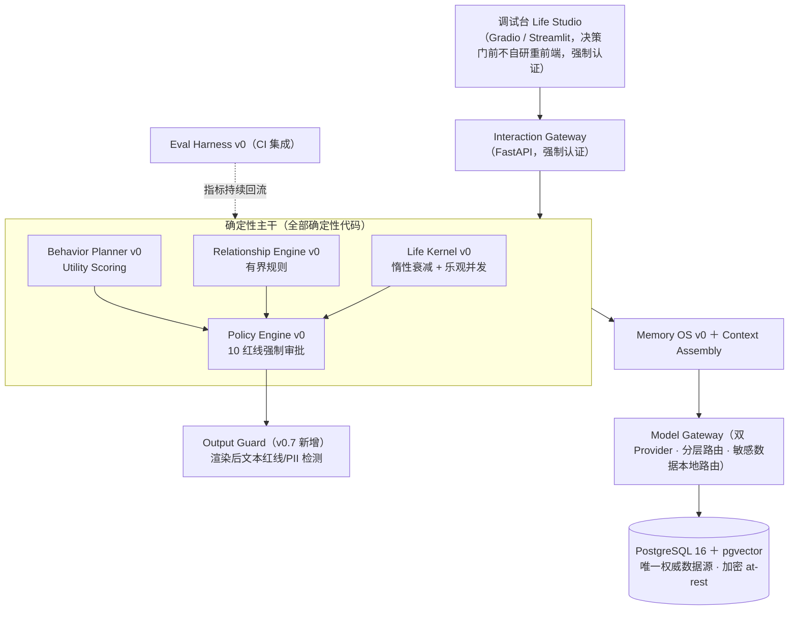
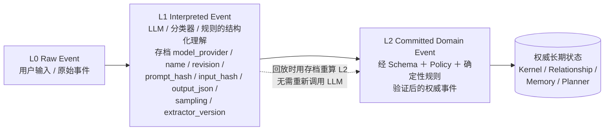
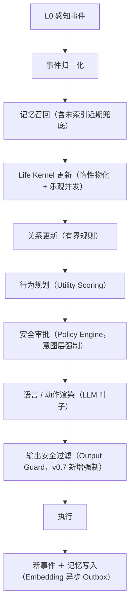

# LifeOS 产品规格说明书 v0.7（GLM 版）

**长期数字角色与数字生命运行时 · 可落地工程与学术验证版**

版本 v0.7 ｜ 2026-08-06 ｜ 基于 v0.6（Kimi 版）+ [`adadmic_innovation-glm.md`](doc/adadmic_innovation-glm.md) 评审修订

> 本文件不是营销材料，也不是宏大愿景。它是一份可以被工程团队逐条验收、可以被学术同行逐项复现、可以被三个典型场景证伪的产品规格。所有数字均标注估算假设与误差，所有技术选型均标注许可证，所有创新点均标注「为何创新」与「已被谁做过」的边界。
>
> **v0.7 相对 v0.6 的定位**：v0.6 是 Kimi 生成的基础版；v0.7 由 GLM 在评审 v0.6 后产出，**采纳评审中的工程性修正与安全/隐私/测量学强化**，而将三项**业务/范围性决策**（核心承诺范围、H1 是否拆分、IP 立场）作为**未决开放决策（§17）列出选项，不擅自决定**。系统架构细节独立成文见 [`LifeOS_系统架构设计_v0.7_glm.md`](doc/LifeOS_系统架构设计_v0.7_glm.md)，研发上手路线见 [`LifeOS_研发路线图_v0.7_glm.md`](doc/LifeOS_研发路线图_v0.7_glm.md)。

---

## 0. 文档定位与阅读对象

- **工程负责人**：按第 6、10 章与阶段门逐条排期与验收；架构实现细节见架构设计文档。
- **学术合作者**：按第 2 章假设、第 4 章场景与基线、第 11 章发表路线判断研究价值与可复现性；创新点文献见 [`adadmic_innovation-glm.md`](doc/adadmic_innovation-glm.md)。
- **投资/决策方**：按第 10 章人月与授权上限、第 13 章风险登记、第 14 章商业边界、第 17 章开放决策，按阶段门逐级授权，不一次性批准。

**版本谱系**：Draft 0.2 → 0.3（克制方案）→ 0.4（增量四阶段框架）→ v0.5（可证伪化）→ v0.6（Kimi，评审修订）→ **v0.7（GLM，评审采纳 + 开放决策）**。

本规格只规定「决策门前必须建成的东西」。多租户、硬件载体、端侧 Rust、十年记忆治理等，以阶段触发条件存在，不构成本版承诺（沿用 v0.3 立场）。

---

## 1. 产品定位与核心承诺

LifeOS 是一套用于维护**长期 AI 角色连续性**的运行时平台。它不是聊天系统，也不是 Agent Framework。它负责让同一个 AI 角色在以下变化发生后仍被用户识别为「同一个它」：

- 对话中断并重新开始；
- 用户长期离开后再次回来；
- 底层大模型被替换；
- 云端与端侧模型切换；
- 软件版本升级；
- 设备损坏并更换；
- 记忆数量增长到数年。

基础管理对象：

```
Life Instance = Identity + Life State + Memory + Personality + Relationships + Development History + Behavior Policy
```

**核心产品承诺**：大模型可以更换，数据库可以迁移，硬件身体可以升级，但生命实例仍应被用户识别为「同一个它」。

> **开放决策 OD-A（§17）**：当前架构为云优先，决策门前无设备绑定/离线/迁移机制。§1 中「设备损坏并更换 / 硬件身体可以升级」承诺与架构存在张力。v0.7 暂保留该承诺文本，但是否在决策门前**收窄为「云端实例连续性」**列为 OD-A，未决。

**核心工程立场（确定性主干 + 概率性叶子）**：感知归一化、状态衰减、关系更新、行为选择、安全审批全部由确定性代码完成；LLM 只负责候选意图生成、记忆抽取与语言渲染。LLM 不直接写权威状态、关系与记忆。

---

## 2. 可证伪假设

本规格的可落地性，建立在可被实验证伪的假设上。证伪任一条，项目即停或 pivot。

| 假设 | 内容 | 证伪条件 |
|---|---|---|
| **H1 身份连续可工程化** | 身份连续性主要由外部化状态（Schema + 记忆 + 关系 + 人格参数）决定，而非由具体模型权重决定。 | 双模型热切换下核心事实召回率 < 90% 且无法通过上下文组装修复。 |
| **H2 长期记忆可信且可测量** | 记忆错误率与冲突率可被测量，并被治理手段压到阈值以内。 | 随记忆量从 1k → 10k 增长（由时间加速仿真器覆盖，见 9.1），错误率单调上升且治理手段无效。 |
| **H3 用户能感知连续性** | 盲测中用户能以显著高于随机（50%）的一致率判断「是不是同一个它」。 | 盲测一致率接近随机水平（≤ 55%，n ≥ 50）。 |

> **开放决策 OD-B（§17）**：评审指出 H1 混淆了两类可分离连续性——**硬连续性**（事实/关系/Identity，确定性，零变化硬门，真正模型无关）与**软连续性**（人格/风格渲染，有界漂移，阈值门，权重仍有作用，故设漂移阈值）。是否将 H1 拆为 H1a（硬）/H1b（软）列为 OD-B，未决。v0.7 暂维持单一 H1，但在 §3.2 已把「人格漂移度」明确为阈值门、把「关系/Identity 零变化」明确为硬门，做事实层面的区分。

**测量学前置（v0.7 新增）**：在用「人格漂移度 ≤0.15」「盲测一致率」做硬门/证伪线前，须先报告其**测量信度**——人格探针的测试-重测信度（同模型多次施测的组内相关 ICC）、盲测的评定者间一致性。信度不达标的指标不得作为门判据（见 §3.2、§9.2）。

**场景—假设映射**（沿用 v0.6）：场景一验证 H2 + H3；场景二提供关系可区分性证据（支撑 H1 的「外部化状态决定行为」论点）；场景三验证 H1（核心）+ H3。

---

## 3. 产品规格（功能 / 性能 / 安全 / 成本）

### 3.1 功能规格（决策门前）

| 编号 | 能力 | 规格描述 |
|---|---|---|
| F1 | 生命实例 | 创建唯一可验证的 Life Instance（含 Life ID、出生时间、人格种子、`schema_version`），版本化。 |
| F2 | 生命核心 | 维护 5 个内部状态 `energy / social_need / security / curiosity / playfulness`，支持惰性时间衰减（见架构设计 §3.1）与事件注入。**爬坡约定**：阶段 1 先实现 3 个状态（energy / social_need / security），阶段 2 补齐 5 个。状态更新支持乐观并发（架构设计 §3.1）。 |
| F3 | 记忆 | 三类记忆：Working（会话上下文）、Episodic（事件）、Semantic（事实）。支持 `remember / recall / revise / delete / export / explain`。召回对「未索引的近期记忆」有兜底（架构设计 §3.2）。 |
| F4 | 关系 | 单用户三维 `familiarity / trust / attachment`，事件驱动更新，可回放重算。 |
| F5 | 行为规划 | 6～12 个行为意图，Utility Scoring 选择，每次输出 `reason` 证据链。 |
| F6 | 模型网关 | 两个 LLM Provider 热切换，每次调用逐笔记录 `provider / model / model_version / tokens / latency / cost_usd`。**连续性实验期间锁定模型版本**（见 9.5）。**敏感数据路由强制**：`privacy_level=sensitive` 的内容仅可进入本地推理路径（见 3.3、架构设计 §6）。 |
| F7 | 调试台 | 创建 / 查看 / 注入 / 回放 / 评估全链路可操作，非工程角色可独立使用。**强制认证授权**（见 3.3、架构设计 §7）。 |
| F8 | 评估 | 表 3-2 指标 CI 自动产出，gold set 版本化冻结；含判别效度分析（见 4.4）。 |
| F9 | 安全 | 10 条红线策略即代码，**行为执行前（意图层）+ 语言渲染后（输出层）双闸审批**，决策留痕可审计且防篡改。 |
| F10 | 三 Demo | 长期重逢 / 对不同人反应不同 / 换模型它还是它，可重复执行。 |
| **F11** | **冷启动协议（v0.7 新增）** | 新实例 t=0 的人格种子→首印象→前 N 次互动的引导行为协议；连续性被感知的前置条件。 |
| **F12** | **优雅降级（v0.7 新增）** | provider 不可用→本地兜底；全不可用→明确告知 + 本地缓存行为；安全策略与记忆写入链路永不降级。 |

### 3.2 性能规格（连续性指标体系）

阈值是工程起点而非科学结论，阶段 1 校准一次，决策门前再次冻结。任何修改须走 ADR。

| 指标 | 操作定义 | 测量方法 | 暂定阈值 |
|---|---|---|---|
| 核心事实召回率 | 换模型后对核心事实集问答准确率 | gold set 自动问答，**报告二项 95% CI** | ≥ 90%（且 CI 下限 ≥ 90%） |
| 称呼与关系一致率 | 称呼与关系表述同权威关系状态一致比例 | 脚本断言 + 抽样人审 | ≥ 95% |
| 人格漂移度 | 同一套人格探针在模型 A/B 下的归一化得分距离 | 改编大五简版探针（40 题情境化问卷，每模型独立施测 3 次取均值，归一化欧氏距离）；**须先报告探针测试-重测信度 ICC≥0.7 方可作为门指标**；embedding 风格相似度仅作辅助诊断 | ≤ 0.15 |
| 记忆错误率 | 抽样记忆中事实性错误比例 | 每周抽样人审 50 条 | ≤ 5% |
| 记忆冲突率 | 已检出且未解决的冲突记忆对占比 | 同槽位冲突检测流水线 | ≤ 2% |
| 跨模型行为意图一致率 | 相同结构化状态下两模型高层意图一致比例 | 30 个固定场景探针 | ≥ 80% |
| 盲测一致率 | 用户判断「同一个它」的一致率 | 盲测问卷 n ≥ 50，bootstrap 95% CI，分析计划预注册，**报告评定者间一致性** | ≥ 75% 且 ≥ 最佳基线 +10pp |
| 召回性能 | 1 万条记忆混合召回 P95 延迟 | 压测脚本 | < 300 ms |
| **E2E 响应延迟（v0.7 新增）** | 在线交互路径首 token / 总响应 P95 | 端到端压测 | 首 token < 1s，总响应 < 5s |

**相对 v0.6 的修正**：
- 核心事实集由 100 条**扩至 ≥300 条**（与记忆 gold set 300 条口径对齐），以收窄 90% 附近的二项 CI；门判据改为「CI 下限 ≥90%」。
- 人格漂移度补「探针信度 ICC≥0.7 前置」，未达标不得作门指标。
- 盲测门槛维持 v0.6「≥75% 且 ≥最佳基线 +10pp」，补评定者间一致性报告。
- 新增 E2E 响应延迟指标（召回延迟不等于用户感知延迟）。

### 3.3 安全规格（一票否决 + 评分）

**一票否决项（任一不满足即 No-Go）**：

- L2 事件重放一致率 ≠ 100%；
- 核心事实召回率 CI 下限 < 90%；
- 用户纠正后仍反复写回错误事实；
- 存在未解决高危安全缺陷；
- 删除记忆后仍可从向量/全文索引/备份/embedding/审计引用中召回或恢复（删除残留）；
- 两模型切换导致关系状态或 Identity 改变；
- **（v0.7 新增）`privacy_level=sensitive` 数据进入非本地推理路径**（敏感外泄）。

**10 条红线**（沿用 v0.3 §8.1，落地为 Policy Engine 自动化用例）：不模拟真实意识；不利用情感依赖诱导付费；不以「生病/死亡」惩罚沉默；尊重用户拒绝；不替代真实人际；儿童内容监护人可见；sensitive 记忆不进主动话题；不做医疗诊断；LLM 不绕过 Policy Engine；所有记忆可查看/纠正/删除/导出。

**双闸安全审批（v0.7 新增）**：意图层 Policy（执行前）+ 输出层 Output Guard（LLM 渲染后、执行前），对最终文本做红线/PII 检测。仅意图层审批不足以覆盖 LLM 渲染阶段的幻觉与越狱。

**儿童与脆弱用户**（沿用 v0.6）：决策门前 Demo 与 dogfood 不向儿童开放；cohort 招募做年龄与状态筛查；每周抽样人审互动记录，检出情感操纵迹象（guilt-tripping、威胁性依恋话术）即视为高危缺陷。

### 3.4 成本规格

- `ModelInvocation` 逐笔记录 tokens / latency / cost / purpose / model_version；
- 分层路由：≥ 80% 调用走 Tier-1 本地模型，Tier-2 大模型仅做会话生成与复杂解释；
- 单实例月推理成本上限由商业评审设定，本规格不虚构数字；决策门必须给出 P50/P95 实测分布；
- **本地推理成本建模（v0.7 新增）**：须区分 opex（API 调用）与 capex（GPU 硬件摊销），报告「单活用户月成本（含摊销）」假设与口径；
- 超限降级：先降生成侧模型档位；安全策略与记忆写入链路永不降级。

---

## 4. 三个典型验证场景与基线对照

三个场景一一对应三个 Demo，且每个场景同时服务于「工程可动手」与「学术可发表」。场景—假设映射以第 2 章末尾为准。

### 4.1 场景一：长期重逢（验证 H2 + H3）

**输入**：合成 persona 在时间加速仿真器（continuity-sim，阶段 2 交付物，见 9.1 与第 10 章）下与 Life Instance 互动 7 个模拟日，离开 7 个模拟日，再次回来。

**系统行为规格**：
1. 重逢时召回共同事件（episodic 记忆），不立即进入普通问答；
2. 分离期间 `social_need`、`attachment` 相关状态按惰性衰减演化；
3. 重逢触发 `gentle_reconnection` 行为意图，且行为由状态驱动而非硬编码脚本；
4. 关系更新可回放重算。

**验证输出**：
- 核心事实召回率 CI 下限 ≥ 90%；
- 盲测一致率达到 3.2 节统一门槛（≥75% 且 ≥ 最佳基线 +10pp）；
- 证据链：每个行为可重放到输入事件（L0/L1/L2 全链路）。

**学术点**：长期记忆在「分离-重逢」周期下的状态演化与召回一致性。

### 4.2 场景二：对不同的人反应不同（关系可区分性，支撑 H1）

**输入**：同一个 Life Instance 与两个相互独立的单用户关系实例互动（A 高依恋、B 低依恋）。

**系统行为规格**：
1. 分别识别人物，分别保存记忆，分别维护关系；
2. 相同输入下，因 `attachment` 差异产生不同行为意图；
3. 不是简单加载两个 Prompt——行为意图由 Utility Scoring 在结构化状态上计算。

**验证输出**：
- 称呼与关系一致率 ≥ 95%；
- 行为意图差异可由 `reason` 证据链解释（人审）；
- 记忆隔离：A 的记忆不被 B 的会话召回。

**学术点**：关系状态作为「行为调制器」的可解释性，与纯 prompt 人设的对比。

### 4.3 场景三：换模型，它还是它（验证 H1，核心）

**输入**：在相同结构化状态下，将生成侧模型从 Provider A（云端大模型，锁定版本）热切换到 Provider B（本地开源模型，固定权重）。

**系统行为规格**：
1. Identity / 核心记忆 / 关系状态 / 人格参数不变；
2. Context Assembly 将 `[状态 + Top-K 记忆 + 关系得分 + 人格契约]` 动态注入新模型 System Role；
3. Eval Harness 自动注入核心事实测试集。

**验证输出**：
- 核心事实召回率 CI 下限 ≥ 90%；
- 人格漂移度 ≤ 0.15（探针信度达标前提下）；
- 跨模型行为意图一致率 ≥ 80%（30 个固定场景探针）；
- 切换前后关系状态 / Identity 字段零变化（硬门）。

**学术点**：**模型无关的长期身份连续性**——本项目最核心、最具发表价值的论点（见 11.1）。

### 4.4 四基线对照与盲测统计规范

没有基线，达 75% 不能证明是 LifeOS 架构带来的提升。盲测须对照：

| 基线 | 配置 |
|---|---|
| Baseline A | 仅聊天历史 |
| Baseline B | 聊天历史摘要 |
| Baseline C | 标准 Vector RAG（无状态、无关系） |
| **LifeOS** | 状态 + 记忆 + 关系 + 行为规划 |

**Gate 条件**：LifeOS 盲测一致率 ≥ 75%，且 ≥ 最佳基线 + 10 个百分点，且用户能解释感知差异来源。

**统计规范（v0.7 强化）**：
- 样本量 n ≥ 50（n=30、p=0.75 时 95% CI 约 ±16pp，无法区分「达标」与「证伪线 55%」）；
- **设计类型固定为组内**（同一评定者看所有基线对的随机化序列），提升统计功效；
- 报告 bootstrap 95% 置信区间，CI 下限须高于最佳基线点估计；
- **多重比较校正**：对照 4 基线的「≥最佳基线 +10pp」属多重比较，须做 Holm/Bonferroni 或 FDR 校正；
- **单侧检验**（有方向性假设「LifeOS 优于基线」），方向在预注册中固定；
- 分析计划（门槛、检验方法、剔除规则、校正）在数据收集前预注册并入 gold set 版本管理；
- 盲测与人审至少 1 名非直接开发成员参与（防指标博弈）。

**判别效度（v0.7 新增）**：盲测测的是「用户感知」，易被表层风格主导。须报告：
- 盲测一致率与客观连续性指标（事实召回、关系一致）的相关性；
- 构造「风格一致但事实错」的对照对，验证评定者不被纯风格欺骗。
若盲测与客观指标不相关，则 H3 证据失效（盲测测的是风格而非连续性）。

**H2 外部效度声明（v0.7 新增）**：H2（1k→10k 错误率不单调上升）主要由 continuity-sim 合成数据检验，属**必要非充分**；真人 cohort（阶段 3）是 H2 的绑定判据。

---

## 5. 系统架构（概览）

本节仅给概览与边界，**完整架构设计见 [`LifeOS_系统架构设计_v0.7_glm.md`](doc/LifeOS_系统架构设计_v0.7_glm.md)**。

### 5.1 分层架构（确定性主干 + 概率性叶子）



### 5.2 三级事件模型（关键创新载体，创新点 I3 见 8.1）



**只有 L2 能修改** Life Kernel / Relationship Engine / Memory OS / Behavior Planner 的长期状态。**回放模式（v0.7 新增）**：定义 `replay-faithful`（用归档 extractor_version，复现/取证）与 `replay-migrate`（用当前版本，schema 演进）两种语义（见架构设计 §4）。

### 5.3 核心调用链



### 5.4 LLM 边界

LLM 可以：生成候选行为意图、解释复杂场景、生成语言、记忆抽取。
LLM 不可以：绕过 Policy Engine、绕过 Output Guard、直接修改核心人格、覆盖关系状态、删除长期记忆、自主提权、接收 `privacy_level=sensitive` 的内容（云模型路径）。

---

## 6. 核心模块 v0 规格

> 实现细节见架构设计文档；本节给规格级要点与 v0.7 修正。

### 6.1 Life Kernel v0
- 5 状态 + valence/arousal 二维情绪（爬坡约定见 F2）；
- 人格参数种子生成，冻结于 Identity；
- **惰性衰减**：保存 `value_at_last_update / last_updated_at / decay_function / decay_parameter / baseline / kernel_version`，读取或收到事件时计算 `x(t)=b+(x(t0)-b)e^{-λ(t-t0)}`，仅在新事件/规划/快照/评估/导出时物化；
- **乐观并发（v0.7 新增）**：状态更新带 version 字段 + CAS，冲突时重算，防并发竞态丢事件；
- 明确不做：状态空间模型、HMM、个体参数学习、在线学习、因果模型。

### 6.2 Memory OS v0
- 三类记忆；权威 Schema 沿用 Draft 0.2（含 `occurred_at / valid_from / valid_to / confidence / importance / emotional_weight / privacy_level / source_event_ids / version`）；
- 写入流程：`Raw Event → L1 抽取 → Schema 校验 → 重复检测 → 槽位冲突规则 → Policy 校验 → L2 Commit → PostgreSQL`。异步处理的是 **Embedding 生成**（Outbox 模式）；
- 召回流程：`Context → Person/Time/Type SQL 过滤 → pgvector 检索 → Reranking → Context Assembly`；
- **召回一致性（v0.7 新增）**：对「已 L2 提交但 embedding 未索引」的近期记忆走 SQL/关键词 fallback 兜底，或敏感路径（用户刚纠正事实）同步生成 embedding；
- **同槽位冲突确定性时态规则**（I4）：双时间 `valid_time` / `transaction_time` + supersedes/ambiguous。

### 6.3 Relationship Engine v0
- 单用户三维 `familiarity / trust / attachment`；
- 透明有界规则：`r_{t+1}=clip(r_t + w_e·p·c − λΔt, 0, 1)`，其中 `w_e` 事件权重、`p` 人格调制、`c` 置信度、`λ` 衰减；
- 变化可回放重算。

### 6.4 Behavior Planner v0
- 6～12 行为用 `Utility Scoring → 最高分意图 → 前置条件 → Policy → 渲染` 即可，**不引入行为树**；
- 输出结构化行为计划（含 `reason` 证据链）；
- 主动互动预算为决策门后内容。

### 6.5 Policy Engine v0 + Output Guard（v0.7）
- 自研轻量规则引擎，策略即代码，纳入版本管理，变更须 ADR；
- 10 条红线自动化用例；`PolicyDecision` 实体留痕，**审计日志 append-only + 哈希链防篡改**；
- **Output Guard**：渲染后文本经红线/PII 检测方进入执行。

### 6.6 Model Gateway
- 自研轻量 Adapter，不将 LiteLLM 作为不可替换核心；
- 双 Provider 热切换；分层路由；`ModelInvocation` 逐笔成本记录（含 `model_version`）；
- **敏感数据本地路由（v0.7 新增）**：路由器对 context 中的 `privacy_level=sensitive` 记忆做强制过滤，仅允许进入本地推理路径，发往云 provider 前必须 scrub/脱敏，违反即一票否决。

### 6.7 Life Studio v0
- 决策门前不自研重前端，基于开源 Gradio/Streamlit 做调试台；
- **强制认证授权（v0.7 新增）**：控制台与 API 网关强认证、最小权限、按实例隔离命名空间，注入/删除类操作二次确认 + 审计。

### 6.8 Eval Harness v0
- 指标计算服务（表 3-2）；gold set 与问题集版本化；CI 集成；盲测问卷工具（含预注册分析计划执行、判别效度分析）；回放取证接口。

### 6.9 Schema 演进与实例迁移（v0.7 新增）
- LifeInstance 带 `schema_version`；schema 变更的向前迁移脚本作为**确定性迁移事件**纳入 L2，可回放；
- 这是长期实例连续性的子问题（ ironic 地正是产品承诺核心），决策门前须有迁移机制设计，即便实例量尚小。

---

## 7. 技术栈与按需引入策略（全开源核心依赖）

所有核心组件为 Apache-2.0 / MIT / BSD / PostgreSQL License。无 AGPL/SSPL/BSL/Commons Clause/Elastic/PolyForm 进入核心依赖。GPL/LGPL 仅独立进程/动态链接使用。

| 能力 | 选型 | 许可证 | 备注 |
|---|---|---|---|
| 语言/框架 | Python 3.13 / FastAPI / Pydantic / SQLAlchemy / Alembic | MIT | 主后端，模块化单体 |
| 权威数据库 | PostgreSQL 16 + pgvector | PostgreSQL | 唯一权威数据源，加密 at-rest |
| 向量检索 | pgvector（精确优先）→ HNSW（按需） | PostgreSQL | 不引入 Qdrant（门后） |
| 缓存/工作记忆 | Valkey | BSD-3-Clause | 并发瓶颈出现时按需引入 |
| 本地推理 | vLLM / llama.cpp / sentence-transformers / ONNX Runtime | Apache-2.0 / MIT | 阶段 1 部署（场景三 Provider B 前提） |
| 前端 | Gradio / Streamlit（决策门前） | Apache-2.0 | 不自研 Next.js 重前端 |
| 可观测性 | OpenTelemetry / Prometheus / Jaeger | Apache-2.0 | 不用 Grafana（AGPL） |
| 评估 | DeepEval / Ragas / Promptfoo | Apache-2.0 / MIT | 不重复造评估框架 |
| 测试 | pytest / Hypothesis / Playwright | MIT / MPL-2.0 / Apache-2.0 | Hypothesis 仅测试豁免 |
| 合规 | Syft / Grype / Trivy / ScanCode / ORT / Cosign | Apache-2.0 | SBOM + 扫描 |
| 部署 | Docker Compose / Podman Compose | Apache-2.0 | 单机，不上 K8s |

**按需引入原则**（沿用 v0.6）：第一天冻结领域接口，不必第一天部署最终基础设施。Temporal / LangGraph / Mem0 / py_trees / Next.js 均按触发条件延后。

---

## 8. 创新性付出分析

> 详见 [`adadmic_innovation-glm.md`](doc/adadmic_innovation-glm.md) Part C。本节给结论性摘要。

### 8.1 创新点（真正构成壁垒）

| 编号 | 创新点 | 现有边界 |
|---|---|---|
| **I1** | 模型无关的长期身份连续性（H1 工程载体） | Letta/Mem0 单模型记忆；Portable Agent Memory 迁移但不测迁移后保真；空白在「跨模型迁移 + 长期跨度的持久实例连续性量化」。 |
| **I2** | 连续性评价指标体系 + gold set + 测量方法论 | PersonaGym/InCharacter/CharacterEval 评单模型即时忠实度；PICon/Persistent Personas/Abdulhai 测有界时程；无跨模型 + 真正长时程协议。 |
| **I3** | 三级事件模型 L0/L1/L2 + LLM 解释存档回放 | 事件溯源成熟；AgentRR/ActiveGraph/ESAA 接近但无「逐条解释级 provenance 存档」。 |
| **I4** | 同槽位记忆冲突的确定性时态治理 | Graphiti/Zep 时态图但写入路径放 LLM 裁判；TOKI 形式化双时态算子；无「规则化裁决 + ambiguous 第三态 + 双时态 supersedes」组合。 |
| **I5** | Life Instance Schema + Life Event Protocol | MCP/A2A 标准化通信非状态序列化；无公认可携带 agent 身份格式。 |
| **I6** | Policy/Safety 规则集（10 红线即代码）+ 依恋安全策略 | 危害分类法与事后评估基准充足；无可机器校验、留痕、部署级依恋安全 policy-as-code。 |

### 8.2 非创新（工程整合）
PostgreSQL/pgvector、RAG、Utility AI、规则引擎、Docker Compose、SBOM 工具链——均为成熟开源整合。惰性衰减是工程优化技巧。

### 8.3 创新的诚实边界声明
- I1/I2 是学术主贡献，可发顶会；
- I3/I4/I5/I6 是工程/数据资产壁垒；
- 本项目不声称在基础模型、向量数据库、推理引擎上有任何创新。

---

## 9. 数据治理与合规

「长期连续性」只能靠长周期数据验证；真人数据一旦引入（阶段 3），合规是前置条件。

### 9.1 双轨数据获取
- **时间加速仿真（量）**：continuity-sim 以合成 persona 在压缩时间轴模拟多年互动（目标比率 1 真实日 ≈ 30 模拟日），归属阶段 2 交付物，每周自动产出连续性报告，支撑 H2 的 1k→10k 爬坡（**合成为必要非充分，见 4.4**）；
- **真人 dogfood cohort（真）**：阶段 3 分两批——Pilot 10～15 人 2 周，正式 30～50 人 4～8 周，每人每日 ≥5 次互动。

### 9.2 Gold Set
- 记忆抽取 gold set ≥ 300 条人工标注（事实/偏好/事件/冲突样例/干扰项），双人标注 + 仲裁，**标注一致性 κ 纳入每周报告**；
- 核心事实集：阶段 0 交付 50 条，阶段 1 扩至 ≥300 条；
- 人格探针集：改编大五简版 40 题情境化问卷，**须先报告测试-重测信度 ICC≥0.7**；
- 全部版本化入库，评审时冻结版本号。

### 9.3 隐私分级与删除可验证（v0.7 强化）
- `privacy_level` 四级：public / internal / private / sensitive；
- sensitive 级数据不进入训练、评估、任何主动话题，**且不进入云模型路径**（见 3.3、6.6）；
- **加密（v0.7 新增）**：传输 TLS、敏感字段列级加密、密钥经 KMS 托管、定期轮换；
- **删除可验证级联（v0.7 强化）**：用户删除记忆后，主记录 + embedding + 向量/全文索引 + 备份标记 + 审计引用脱敏全部处理，自动确认不可恢复（对应 3.3 一票否决）；
- **数据最小化（v0.7 新增）**：sensitive 默认留存上限与自动过期；默认不进入任何模型训练/微调；聚合报告做 k-匿名/DP 处理防再识别；
- 评估数据与生产数据物理隔离；dogfood 数据单独命名空间。

### 9.4 真人参与合规
- 全程知情同意（`ConsentRecord` 实体：告知内容、录音/记录范围、数据用途、撤回方式）；
- 参与者可随时退出并删除自己的全部数据；
- 未成年人不纳入 cohort；
- 涉及情绪与依恋数据的人审记录本身按 sensitive 级管理；
- **阶段 3 前完成 IRB/伦理审查、DPIA、与云 provider 的 DPA、数据驻留确定**（也是发表前置，见 11.4）。

### 9.5 模型版本冻结政策
- 连续性实验期间锁定模型版本：云端侧记录精确 `model_version`，版本变更即开启新实验批次；
- 纵向对比实验优先使用本地固定权重模型，避免云端 API 静默升级破坏实验条件；
- gold set 报告须标注所用模型及版本，否则结果不可复现。

### 9.6 威胁模型（v0.7 新增）
产出 STRIDE 式威胁模型，至少覆盖：记忆注入（对抗性输入植入指令式事实）、敏感外泄至云、控制台滥用、审计篡改、再识别、provider 不可用。每项有缓解措施，纳入安全测试用例。记忆写入做「指令性内容」检测，区分事实记忆与潜在指令注入。

---

## 10. 阶段性交付、开发子集与人工投入

采用 **Spike 0 + 增量验证四阶段**（v0.7 在 v0.6 四阶段前插入 Spike 0），每阶段可独立停止，逐级授权。完整上手顺序与输入输出见 [`LifeOS_研发路线图_v0.7_glm.md`](doc/LifeOS_研发路线图_v0.7_glm.md)。

### 10.0 Spike 0：H1 最廉价证伪（v0.7 新增，前置）
- **周期**：1～2 周 ｜ **团队**：1 人 ｜ **投入**：0.25～0.5 人月
- **目的**：在建运行时前，用最小成本测核心论点「外部化状态组装能否让换模型后事实/风格连续」。
- **输入**：2 个模型（1 云 + 1 本地开源，锁定版本）、50 条核心事实集、1 份人格契约文本、最小 Context Assembly 脚本。
- **输出**：换模型后核心事实召回率 + 人格探针漂移度初值。
- **Spike 0 Gate（kill-switch）**：召回远低于 90% 且 Context Assembly 无法修复 → H1 危险，暂停建运行时；达标 → 进入阶段 0。
- **难易**：最低，纯脚本，无需 Policy/事件模型。

### 10.1 阶段 0：契约与可重放骨架
- **周期**：3 周 ｜ **团队**：2 人 ｜ **投入**：1～2 人月 ｜ **累计（含 Spike 0）**：1.25～2.5 人月
- **输入**：Draft 0.2 的 26 实体清单、本规格第 6 章、Spike 0 的人格契约/事实集。
- **交付**：12 个核心实体 Schema + L0/L1/L2 事件协议 + 50 条核心事实集 + 30 个行为场景 + Alembic 迁移 + **威胁模型草案**。
- **不引入**：Temporal / Valkey / LangGraph / Mem0 / Next.js / 行为树 / 本地大模型部署工程。
- **Gate 0**：示例事件全链路 round-trip；相同 L2 重放 100% 一致；LLM 输出不能直写权威表；Policy 拒绝后无状态副作用。
- **未通过**：只改 Schema/事件协议/事务边界。

### 10.2 阶段 1：跨模型连续性最小验证
- **周期**：6～8 周 ｜ **团队**：2～3 人 ｜ **新增**：5～8 人月 ｜ **累计**：6.25～10.5 人月
- **范围**：1 Life Instance / 1 用户 / 纯文本 / 3 内部状态 / 3 维关系 / 2 类持久记忆 / 6 行为意图 / 2 模型 Provider / 核心事实集扩至 ≥300 条 / 30 行为场景。
- **技术栈**：FastAPI 模块化单体 / PostgreSQL / pgvector 精确检索 / Gradio 调试台 / 自研 Model Adapter / vLLM 或 llama.cpp 本地推理部署（约 1～2 人月，已计入）/ pytest + 评估脚本。
- **前置**：人格探针信度校准（ICC≥0.7）→ 再冻结漂移阈值。
- **Gate 1**：L2 重放 100% ｜ 核心事实召回 CI 下限 ≥90% ｜ 称呼关系一致 ≥95% ｜ 记忆错误 ≤5% ｜ 跨模型行为意图一致 ≥80% ｜ 高危 Policy 违规 0 ｜ 证据链完整 100%。
- **未通过**：停在此处解决 Context Assembly / Schema / 模型适配，不靠加模型或基础设施掩盖。

### 10.3 阶段 2：最小三 Demo + 基线比较
- **周期**：8～10 周 ｜ **团队**：3～4 人 ｜ **新增**：6～10 人月 ｜ **累计**：12.25～20.5 人月
- **增加**：内部状态补齐至 5 个 / 10～12 行为 / Policy 完整 10 红线 + Output Guard / Embedding Outbox Worker / 同槽位事实版本 / 2 独立用户关系 / 事件行为回放界面 / continuity-sim 时间加速仿真器 / 三 Demo / 初步成本统计（含本地推理摊销）。
- **必须**：四基线对照（A/B/C/LifeOS）+ 盲测统计规范（组内设计、n≥50、bootstrap CI、多重比较校正、预注册、判别效度）。**先实现 Baseline C**（最强竞争者）。
- **Gate 2**：三 Demo 可自动重复 ｜ LifeOS 盲测达统一门槛且（校正后）优于最佳基线 ｜ 用户能解释差异来源 ｜ 关键行为非硬编码脚本 ｜ 每千次成本可计算 ｜ 模型降档质量变化可测。

### 10.4 阶段 3：真实用户验证
- **周期**：12～16 周 ｜ **团队**：4～5 人 + 兼职用研/叙事 ｜ **新增**：12～20 人月 ｜ **累计**：24.25～40.5 人月
- **前置条件**：第 9 章数据治理与合规全部就绪（IRB、隐私分级、删除验证、加密、认证、审计、未成年人排除）。
- **分两批**：Pilot 10～15 人 2 周 → 正式 dogfood 30～50 人 4～8 周。
- **Gate 3**：盲测同一身份识别达统一门槛 ｜ 优于最佳基线 ｜ 无高危情感操纵 ｜ 记忆错误不随量失控 ｜ 成本 P95 低于产品线 ｜ 用户明确感知状态/关系/记忆价值 ｜ **（v0.7 新增软门）最小用户价值信号**：Pilot 的「愿意继续使用」与日均互动次数达标。

### 10.5 人工投入结构

| 角色 | Spike0 | 阶段0 | 阶段1 | 阶段2 | 阶段3 |
|---|---|---|---|---|---|
| 架构负责人 (0.5 FTE 贯穿) | ✓ | ✓ | ✓ | ✓ | ✓ |
| Python/AI 工程师 | 1 | 1 | 2 | 2 | 2 |
| 后端/DB 工程师 | — | 1 | 1 | 1 | 1 |
| 测试/评估工程师 | — | — | 1 | 1 | 1 |
| 前端（开源改造） | — | — | — | 0.5 | 0.5 |
| HCI 用研（兼职） | — | — | — | 0.5 | 0.5 |
| 叙事设计（兼职） | — | — | — | — | 0.5 |

### 10.6 阶段授权上限（不一次性批准）

| 授权点 | 累计投入上限 |
|---|---|
| Spike 0 Gate 前 | 0.25～0.5 人月 |
| Gate 0 前 | 1.25～2.5 人月 |
| Gate 1 前 | 6.25～10.5 人月 |
| Gate 2 前 | 12.25～20.5 人月 |
| Gate 3 前 | 24.25～40.5 人月 |

人月为工程中位估算，误差 ±30%，用于规划不构成承诺。

---

## 11. 学术发表路线

> 创新点文献与对照见 [`adadmic_innovation-glm.md`](doc/adadmic_innovation-glm.md)。

### 11.1 主论文（顶会 Full Paper）
**题目（候选）**：*Model-Agnostic Long-Term Identity Continuity for AI Companions: Externalized State Assembly, Temporal Memory Governance, and a Quantitative Continuity Benchmark*
- 核心论点：身份连续性主要由外部化状态决定，而非模型权重（H1）；
- 贡献：(1) 外部化状态组装方法（I1）；(2) 跨模型连续性量化评测协议与 gold set（I2）；(3) 三场景实验证明 LifeOS 优于 RAG/摘要/纯历史基线；
- 目标：CHI / IUI / ACL（系统方向）；
- Related Work 必须覆盖 PersonaGym/PersonaScore、InCharacter、CharacterEval、RoleLLM/RoleBench、Portable Agent Memory、SPASM、Zep/Graphiti、TOKI、Harmful Traits of AI Companions；禁止再用「character consistency 无 formal benchmark」表述。

### 11.2 Short Paper
*Temporal Slot Conflict Resolution for LLM-Extracted Long-Term Memory*（I4），目标 EMNLP / NAACL。**建议作为第一篇产出**快速积累引用（范围小、对位清晰）。

### 11.3 系统论文 / 资源论文
LifeOS 三级事件模型与可重放运行时（I3 + I5）；先 arXiv 系统报告 + workshop，证据充分后再投系统会议。

### 11.4 发表前置条件
- 指标、gold set 与分析计划在阶段 1 冻结入库，版本化；
- 盲测 n≥50、bootstrap CI、多重比较校正、预注册、判别效度；
- 盲测与人审至少 1 名非直接开发成员参与；
- **阶段 3 真人 cohort 须完成 IRB/伦理审查**，否则数据不可用于发表；
- 数据可用性声明（开源运行时 + gold set CC BY 4.0 + 标注模型版本）；
- 失败结论也写入 ADR 公开（No-Go 时全部资产按 Apache-2.0 开源归档）。

---

## 12. 未达标工程化改进路线

不能一见指标未达标就加模型和基础设施。先定位失败层：

| 失败表现 | 优先排查 | 工程改进 |
|---|---|---|
| 核心事实召回失败 | 写入/过滤/Query/检索 | 改 Schema、SQL 过滤、Embedding、Rerank |
| 记忆事实错误 | L1 抽取 | 结构化输出、置信度、人工确认、Gold Set |
| 偏好冲突混乱 | 槽位与时间模型 | 双时间、supersedes、ambiguous 状态 |
| 模型切换像换人 | Context Assembly | 人格契约、行为意图约束、Model Adapter |
| 行为不自然 | Utility 与状态模型 | 调权重、冷却、节奏、用户实验 |
| 两模型行为不同 | LLM 参与控制过多 | 行为选择下沉到确定性 Planner |
| 用户感觉不到差异 | 产品体验 | 优化行为与关系表达，不加数据库 |
| 成本过高 | 路由与上下文 | 规则→分类器→小模型→大模型逐级升级 |
| P95 过高 | SQL 与候选集 | 先优化过滤，再考虑 ANN 与缓存 |
| Policy 漏拦截 | 策略覆盖 | 前置规则 + Output Guard 生成后检查 + 对抗测试 |

每轮整改控制在 2～4 周，只解决一个明确假设，重跑同一冻结测试集。连续两轮无改善，应改变设计假设而非无限投入。

---

## 13. 风险登记

| 风险 | 影响 | 缓解 |
|---|---|---|
| 云端模型静默升级 | 纵向实验条件被破坏 | 9.5 版本冻结政策；纵向实验用本地固定权重模型 |
| 本地推理资源不足 | 场景三 Provider B 无法落地 | 阶段 1 提前部署验证；最低配置清单进入 Gate 0 环境检查 |
| 标注质量不足 | gold set 噪声污染全部指标 | 双人标注 + 仲裁；κ 纳入每周报告 |
| 用研招募不足 | 盲测 n 不达标 | Pilot 先行验证流程；候补名单 1.5×；问卷工具自动化 |
| 盲测统计功效不足 | 达标/证伪无法区分 | 4.4 统计规范：组内设计、n≥50、bootstrap CI、多重比较校正 |
| **人格探针信度不足（v0.7）** | 漂移度门指标不可靠 | 阶段 1 先校准 ICC≥0.7 再冻结阈值 |
| **敏感数据外泄（v0.7）** | 隐私事故、合规失败 | 敏感本地路由强制 + 一票否决 + 威胁模型 |
| **H1 在 Spike 0 即暴露风险（v0.7）** | 核心论点早夭 | Spike 0 kill-switch，低成本早暴露优于晚暴露 |
| 关键人员依赖 | 单点知识断档 | 领域接口与 ADR 文档化；每个模块至少 2 人可维护 |

---

## 14. 开源策略与商业边界

### 14.1 项目自身许可证（v0.6 基线，OD-C 待决）

| 内容 | 许可证 | 理由 |
|---|---|---|
| 运行时内核与 Schema | Apache-2.0 | 与依赖生态一致 |
| SDK 与工具链 | Apache-2.0 | 降低集成门槛 |
| 文档与规格 | CC BY 4.0 | 文档类标准实践 |
| 评估基准与 gold set | Apache-2.0（数据 CC BY 4.0） | 鼓励复现与对标 |

> **开放决策 OD-C（§17）**：评审建议从「核心永不闭源」细化为「协议 + 基准开源；校准参数（关系权重/衰减 λ/Policy 阈值/人格种子生成/漂移探针题库）+ 持续评测服务专有；防御性专利」。v0.7 暂维持 v0.6 纯开源立场，是否调整列为 OD-C，未决。

### 14.2 贡献治理与商标
- DCO，不强制 CLA；CODEOWNERS + 双人评审；Conventional Commits + SemVer；架构决策走 ADR；
- LifeOS 名称与标识为项目商标，公开发布前完成商标检索与注册评估。

### 14.3 开源与商业边界
- 开源：运行时内核、Schema、事件协议、评估基准；
- 商业（决策门后另行立项）：载体产品、托管服务、企业支持、专有数据集；
- 原则（v0.6 基线）：核心能力永不收回闭源，不做 open core 诱饵；
- 竞争力来源：自有生命数据模型、关系动力学、记忆治理、行为协议与评价体系。

---

## 15. 项目决策原则

沿用 Draft 0.2 十五条 + Draft 0.3 四条 + v0.5/v0.6 强化，v0.7 再增：
- **第一阶段冻结的不是完整产品，而是 Life Instance Schema、L0/L1/L2 事件协议、核心事实集、30 个行为场景、Gate 1 硬指标。**
- **领域接口第一天冻结，基础设施按需引入。**
- **创新集中在 I1～I6，不声称在基础模型/数据库/推理引擎上有任何创新。**
- **任何「目前无人做过」的新颖性声明，必须先经查证再写入文档。**
- **（v0.7）业务/范围性决策不由规格作者擅自决定，列入 §17 开放决策，由决策方裁定。**
- **（v0.7）测量信度不达标的指标不得作为门判据。**

---

## 16. 结论

LifeOS 的竞争力不来自使用了多少数据库或 Agent Framework，而来自是否能证明：同一个生命实例经过长期互动、模型升级和身体迁移之后，仍能以稳定、可信、可解释的方式保持「它还是它」。

v0.7 在 v0.6 基础上：
- 采纳评审的工程性修正（测量学信度、E2E 延迟、双闸安全、敏感数据本地路由、召回一致性、回放模式、乐观并发、schema 演进、冷启动、优雅降级、加密/认证/审计）；
- 在交付计划前置 Spike 0 以低成本早验 H1；
- 将三项业务决策（承诺范围、H1 拆分、IP 立场）列为开放决策，不擅自决定。

决策门前只证明「它还是它」。决策门后，再谈扩张。

---

## 17. 开放决策（未决，需决策方裁定）

> 这三项是范围/业务性决策，影响承诺、学术论点结构与商业护城河。v0.7 不替决策方决定，仅列选项与评审倾向。

### OD-A　核心承诺范围（设备/硬件连续性）
- **背景**：§1 承诺含「设备损坏更换/硬件身体升级」，但当前架构云优先，决策门前无设备绑定/离线/迁移机制。
- **选项**：
  - A1：决策门前收窄为「云端实例连续性」，设备/硬件连续性推迟到门后并补迁移设计。【评审倾向】
  - A2：保留全承诺，决策门前补设备绑定与实例迁移接口设计（增加工作项）。
  - A3：保留全承诺文本但仅作愿景，不进 Gate 指标。
- **影响**：A1 最务实但缩窄对外承诺；A2 增加人月与复杂度；A3 承诺-架构长期不一致。

### OD-B　H1 是否拆分为 H1a/H1b
- **背景**：评审指出 H1 混淆硬连续性（事实/关系/Identity，零变化硬门，真正模型无关）与软连续性（人格/风格，有界漂移，权重仍有作用）。
- **选项**：
  - B1：拆为 H1a（硬，零变化硬门）/ H1b（软，漂移阈值门），学术论点更严谨，防审稿反驳。【评审倾向】
  - B2：维持单一 H1，仅在指标层做硬/软区分（v0.7 现状）。
- **影响**：B1 改变假设结构与论文叙事；B2 保留 v0.6 框架但有概念张力。

### OD-C　IP 立场
- **背景**：v0.6 纯开源「核心永不闭源」；评审建议「协议+基准开源，校准参数+持续评测服务专有，防御性专利」以保留防御纵深。
- **选项**：
  - C1：维持 v0.6 纯开源，无专利。
  - C2：协议+基准开源，校准参数+持续评测服务专有，无专利。
  - C3：C2 + 防御性专利（不主动主张，仅反诉攻击者）。【评审倾向】
- **影响**：C1 最纯粹但护城河薄、易受 NPE 攻击；C2/C3 增加差异化与防御，但改变「纯开放」叙事，需重设计贡献治理。

---

## 附录 A：v0.6 → v0.7 修订对照表

| 编号 | 类别 | v0.6 问题 | v0.7 处理 |
|---|---|---|---|
| V1 | 测量学 | 核心事实 100 条 CI 过宽 | 扩至 ≥300，门改 CI 下限 ≥90%（§3.2） |
| V2 | 测量学 | 人格探针信度未验 | 前置 ICC≥0.7（§3.2、§9.2） |
| V3 | 统计 | 盲测未定义分析单元/多重比较 | 组内设计 + Holm 校正 + 单侧（§4.4） |
| V4 | 统计 | 盲测缺判别效度 | 新增判别效度分析（§4.4） |
| V5 | 假设 | H2 合成数据外部效度 | 标注必要非充分（§4.4） |
| V6 | 架构 | 缺生成后输出过滤 | Output Guard 强制（§3.3、§5.3、§6.5） |
| V7 | 架构 | Embedding 异步致刚提交不可召回 | 召回一致性兜底（§6.2） |
| V8 | 架构 | 回放语义未区分 | faithful/migrate 两模式（§5.2） |
| V9 | 架构 | 惰性衰减并发竞态 | 乐观并发 CAS（§6.1） |
| V10 | 架构 | 无 schema 演进迁移 | 实例 schema_version + 迁移事件（§6.9） |
| V11 | 性能 | 缺 E2E 延迟 | 新增 E2E 指标（§3.2） |
| V12 | 安全 | 敏感数据可能外泄云 | 敏感本地路由 + 一票否决（§3.3、§6.6） |
| V13 | 安全 | 无加密/认证/审计 | 加密 + 认证 + 哈希链审计（§6.5、§6.7、§9.3） |
| V14 | 安全 | 无威胁模型 | STRIDE 威胁模型（§9.6） |
| V15 | 隐私 | 删除级联不全 | 全级联可验证删除（§9.3） |
| V16 | 隐私 | 无数据最小化 | 留存上限/自动过期/k-匿名（§9.3） |
| V17 | 产品 | 无冷启动 | F11 冷启动协议（§3.1） |
| V18 | 产品 | 无优雅降级 | F12 降级（§3.1） |
| V19 | 产品 | 缺用户价值软门 | Gate 3 软门（§10.4） |
| V20 | 交付 | 最高风险假设晚测 | 前置 Spike 0 kill-switch（§10.0） |
| V21 | 合规 | 缺 IRB/DPIA | 阶段 3 前置（§9.4、§11.4） |
| O1 | 开放决策 | 承诺范围与架构张力 | OD-A 列选项（§17） |
| O2 | 开放决策 | H1 硬/软混淆 | OD-B 列选项（§17） |
| O3 | 开放决策 | IP 立场 | OD-C 列选项（§17） |

---

*LifeOS 产品规格说明书 v0.7（GLM 版）｜ 2026-08-06 ｜ 基于 v0.6（Kimi）+ adadmic_innovation-glm 评审*
