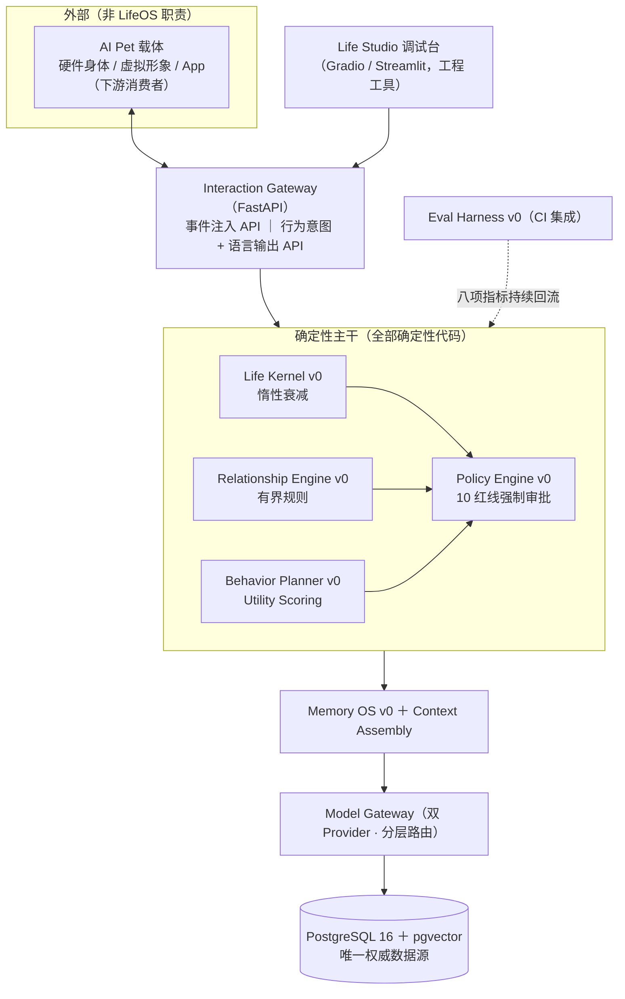
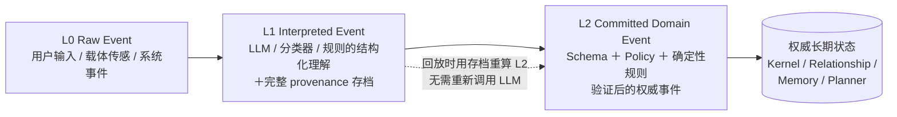
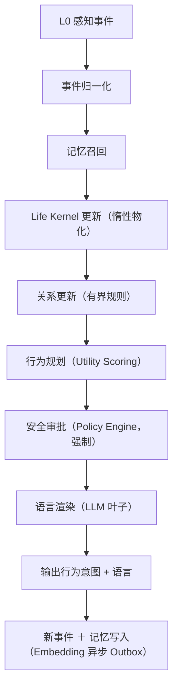

# LifeOS 架构设计 v0.8

**配套文档**：《LifeOS 产品规格说明书 v0.8》（验收口径与阈值以规格书为准，本文档不重复定义阈值）。

版本 v0.8 ｜ 2026-08-06 ｜ 首次独立成文（自规格书 v0.6 第 5、6 章抽离并深化到字段级）

> 本文档回答「怎么实现」。范围边界与规格书 §1.1 一致：LifeOS 是驱动 AI Pet 心智软资产（身份/记忆/人格/社会关系）的运行时，**不输出运动控制指令，不包含产品交互界面**。

---

## 1. 架构目标与约束

**目标**：

1. 换模型、换库、换载体后，Life Instance 仍是「同一个它」（规格书 H1/H3）；
2. 任何长期状态的来源可审计、可回放、可重算（重放一致率 100%）；
3. LLM 的能力被限制在「叶子」位置：生成候选、抽取、渲染，永不直写权威状态。

**硬约束**：

- 单一权威数据源：PostgreSQL 16 + pgvector；其他存储（Valkey 等）只允许做可重建的派生缓存；
- 所有写路径经 L0→L1→L2 事件管线，无后门写入；
- 全开源依赖（Apache-2.0 / MIT / BSD / PostgreSQL License），见规格书 §7；
- 单机 Docker Compose 部署，不上 K8s（决策门前）。

---

## 2. 分层架构



**载体边界（v0.8 新增）**：LifeOS 对载体只暴露两类 API——`POST /events`（注入 L0 事件）与 `GET /intent-stream`（结构化行为意图 + 已审批语言输出）。行为意图的 `modality` 字段仅为提示性枚举（`verbal / expressive / attentional`），**不含任何运动学参数**；载体自行决定如何表达。载体适配层是独立项目，不进入本仓库核心依赖。

---

## 3. 三级事件模型（L0/L1/L2）

### 3.1 模型定义



**只有 L2 能修改** Life Kernel / Relationship Engine / Memory OS / Behavior Planner 的长期状态。

### 3.2 L1 provenance 存档（I3 的差异化核心，v0.8 字段级定义）

每条 L1 事件必须存档以下字段，缺一不入库：

| 字段 | 说明 |
|---|---|
| `interpreter_type` | `llm / classifier / rule` |
| `model_provider` / `model_name` / `model_version` | LLM 解释时必填；版本冻结政策见规格书 §9.5 |
| `prompt_template_id` / `prompt_hash` | 提示模板标识与内容哈希 |
| `input_hash` | L0 事件内容哈希 |
| `output_json` | 结构化解释结果（Schema 校验前的原始输出） |
| `sampling_params` | temperature 等采样参数 |
| `extractor_version` | 解释器代码版本（git commit 或 SemVer） |
| `interpreted_at` | 解释时间戳 |

**与文献的边界**（诚实声明）：事件溯源 + LLM agent 的宏观架构已有 AgentRR（arXiv 2505.17716）、ActiveGraph（arXiv 2605.21997）、ESAA（arXiv 2602.23193）。本设计的增量**仅**在于：把「哪条解释由哪个模型/提示/代码版本产生」作为一等公民字段持久化，使 L2 重推导完全确定性、可逐条取证。这不构成对事件溯源本身的新颖性声明。

### 3.3 回放算法

```
replay(life_id, from_seq, to_seq):
    for event in l1_store.range(life_id, from_seq, to_seq):   # 按 L1 存档顺序
        l2 = deterministic_commit(event.output_json,          # 与在线路径同一函数
                                  schema_version=event.schema_version,
                                  policy_version=event.policy_version,
                                  rules_version=event.extractor_version)
        assert l2 == l2_store.get(event.l2_id)                # 一致性断言
```

- 在线路径与回放路径**调用同一个 `deterministic_commit` 函数**，禁止两套实现；
- 规则/策略/Schema 版本变更时，旧版本代码保留可执行（容器镜像固化），回放按事件当时版本执行；
- 验收：相同 L2 序列重放 100% 一致（规格书一票否决第 1 条）。

### 3.4 核心调用链



**LLM 边界**：可以做——生成候选行为意图、解释复杂场景、生成语言、记忆抽取；不可以做——绕过 Policy Engine、直接修改核心人格、覆盖关系状态、删除长期记忆、自主提权。

---

## 4. 数据模型（12 核心实体，阶段 0 冻结）

| 实体 | 关键字段 | 说明 |
|---|---|---|
| `LifeInstance` | `life_id, born_at, personality_seed, schema_version, status` | 生命实例根实体 |
| `PersonalityContract` | `life_id, big_five_params, expression_style, frozen_at` | 人格契约，生成后冻结，变更走 ADR |
| `RawEvent` (L0) | `event_id, life_id, source, modality, payload, occurred_at` | 原始事件，不可变 |
| `InterpretedEvent` (L1) | `event_id, raw_event_id, output_json, + §3.2 全部 provenance 字段` | 解释事件，不可变 |
| `DomainEvent` (L2) | `event_id, l1_event_id, event_type, payload, schema_version, policy_version, committed_at` | 权威事件，不可变 |
| `LifeState` | `life_id, state_key, value_at_last_update, last_updated_at, decay_function, decay_parameter, baseline, kernel_version` | 惰性衰减所需全部字段 |
| `MemoryRecord` | `memory_id, life_id, type, content, slot_key, valid_from, valid_to, transaction_from, transaction_to, confidence, importance, emotional_weight, privacy_level, source_event_ids, conflict_state, version` | 双时态 + 冲突状态机 |
| `RelationshipState` | `life_id, subject_id, familiarity, trust, attachment, updated_at, version` | 每关系实例一行，可回放重算 |
| `BehaviorIntent` | `intent_id, life_id, intent_type, modality, utility_score, reason, preconditions, created_at` | `reason` 为证据链 JSON |
| `PolicyDecision` | `decision_id, intent_id, rules_hit, result, overridden_by, decided_at` | 审批留痕 |
| `ModelInvocation` | `invocation_id, provider, model, model_version, tokens, latency_ms, cost_usd, purpose, called_at` | 逐笔成本与版本记录 |
| `EvaluationRun` | `run_id, gold_set_version, model_version, metrics_json, ci_pass, ran_at` | 评估留痕 |

**不变式**：`RawEvent / InterpretedEvent / DomainEvent` 三表只插不改（append-only）；权威状态表（`LifeState / RelationshipState / MemoryRecord`）只能由 L2 事件处理函数写入；`MemoryRecord` 的冲突解决不删除历史版本，只更新 `transaction_to` 与 `conflict_state`。

---

## 5. 核心模块设计

### 5.1 Life Kernel v0

- 状态：`energy / social_need / security / curiosity / playfulness`（阶段 1 先 3 个）+ `valence / arousal`；
- **惰性衰减**：`x(t) = b + (x(t0) − b)·e^(−λ(t−t0))`，`b` 为 baseline，`λ` 为 decay_parameter；仅在新事件到达、规划、快照、评估、导出时物化，无后台写轮询；
- 事件注入：L2 事件携带 `state_delta`，物化时先衰减到当前时刻再叠加 delta；
- 人格参数：创建时由 `personality_seed` 确定性派生（同一种子必得同一组参数），写入 `PersonalityContract` 后冻结；
- 技术方法：有限状态机 + 离散动态系统（transitions / NumPy / Pydantic）；
- **明确不做**：状态空间模型、HMM、个体参数学习、在线学习、因果模型。

### 5.2 Memory OS v0

**写入管线**（同步到 L2 Commit，Embedding 异步）：

```
Raw Event → L1 抽取（LLM，结构化输出）→ Schema 校验 → 重复检测
→ 槽位冲突规则（确定性，见下）→ Policy 校验 → L2 Commit → PostgreSQL
                                                    ↘ Outbox → Embedding Worker（异步）
```

**召回管线**：`Context → Person/Time/Type SQL 过滤 → pgvector 精确检索 → Reranking → Context Assembly`。先精确检索，P95 不达标才评审引入 HNSW。

**同槽位冲突的确定性时态治理（I4）**：

- 语义记忆带 `slot_key`（如 `user.pet_name`）；同槽位新事实到达时：
  - LLM 只**提议** `{slot, old, new, relation, confidence}`，`relation ∈ {update / contradict / coexists}`；
  - **规则裁决**（非 LLM）：
    - `update` 且 confidence ≥ 阈值 → 旧版本 `transaction_to = now`、`conflict_state = superseded`，新版本生效；
    - `contradict` 或 confidence 不足 → 新旧并存，`conflict_state = ambiguous`，进入人工确认队列，**召回时 ambiguous 记忆降权并标注**；
    - `coexists` → 双版本共存；
- 双时间：`valid_from/valid_to`（现实生效时间）与 `transaction_from/transaction_to`（系统知晓时间）；
- **与文献的对位**（诚实声明）：双时态建模来自 Graphiti/Zep（arXiv 2501.13956）；冲突裁决算子已被 TOKI（arXiv 2606.06240）形式化；STALE（arXiv 2605.06527）证明 LLM 自判冲突仅 ~55% 准确率。本设计的差异化仅剩一点：**写入路径无 LLM 裁判 + ambiguous 第三态进人工队列**。实现时应直接参考 TOKI 的算子语义，避免重复发明。

### 5.3 Relationship Engine v0

- 三维 `familiarity / trust / attachment ∈ [0,1]`，每 `(life_id, subject_id)` 一行；
- 更新规则（透明有界，非学习模型）：`r_{t+1} = clip(r_t + w_e · p · c − λ·Δt, 0, 1)`，其中 `w_e` 事件权重表（L2 事件类型查表）、`p` 人格调制系数、`c` 事件置信度、`λ` 衰减系数；
- 全部参数版本化入 `kernel_version`，变化可回放重算；
- 记忆隔离：召回 SQL 过滤强制带 `subject_id` 谓词（场景二验收点）。

### 5.4 Behavior Planner v0

- 流程：候选意图集（6～12 个，枚举注册）→ Utility Scoring（状态、关系、人格、冷却时间的加权和）→ 最高分意图 → 前置条件检查 → Policy 审批 → 语言渲染；
- 输出 `BehaviorIntent`：`intent_type + modality + utility_score + reason`，`reason` 记录每个候选的得分分解（证据链，供人审与场景二验收）；
- **不引入行为树**；触发条件（行为 >15、多层 fallback、中断恢复）满足再评审 py_trees；
- 决策门前所有行为由事件与状态驱动，无主动互动预算。

### 5.5 Policy Engine v0

- 自研轻量规则引擎（约数百行，不引入 Drools 级框架）：规则为带版本的代码 + YAML 配置，纳入仓库管理，变更须 ADR；
- 执行点：行为意图执行前强制调用；拒绝时返回结构化理由且**无任何状态副作用**（Gate 0 验收点）；
- 10 条红线各有自动化测试用例；`PolicyDecision` 全量留痕（输入/命中规则/结果/覆盖人/时间）；
- 人工覆盖通道存在但留痕并计高危审计事件。

### 5.6 Model Gateway

- 自研轻量 Adapter（接口：`generate / extract / embed`），LiteLLM 不作为核心依赖；
- 双 Provider 热切换：切换动作本身记录为系统 L0 事件；切换前后 `RelationshipState / Identity` 字段断言零变化（一票否决第 6 条）；
- 分层路由：Tier-1 本地模型（≥80% 调用）/ Tier-2 云端大模型；路由规则确定性；
- 每次调用写 `ModelInvocation`（含 `model_version`，支撑版本冻结政策）。

### 5.7 Context Assembly

- 输出给生成侧模型的 System Role 组装：`[人格契约 + 当前状态摘要 + Top-K 记忆 + 关系得分 + 行为意图约束]`；
- 组装函数纯函数化：相同数据库快照必得相同 prompt（支撑跨模型一致率测量）；
- Top-K 与模板版本化（`prompt_template_id`），纳入 gold set 报告标注。

### 5.8 Life Studio v0（调试台）

- Gradio/Streamlit 单体：实例创建、状态面板、事件注入、记忆回放、评估面板；
- 定位是**工程工具**；任何产品级交互需求一律拒绝（边界见规格书 §1.1）。

### 5.9 Eval Harness v0

- 指标计算服务（规格书表 3-2 八项）；gold set 与问题集版本化；CI 集成（每次合并跑核心子集，全量夜间跑）；
- 盲测问卷工具：执行预注册分析计划，输出 bootstrap CI；
- 回放取证接口：`/replay/{life_id}` 触发 §3.3 回放并输出一致性报告。

---

## 6. 接口契约（对外 API 摘要）

| 端点 | 用途 | 备注 |
|---|---|---|
| `POST /instances` | 创建 Life Instance | 返回 life_id 与人格契约 |
| `POST /events` | 注入 L0 事件 | 载体与调试台共用入口 |
| `GET /intent-stream` | 行为意图 + 语言输出 | WebSocket/SSE；输出类型冻结为结构化意图 |
| `GET /state/{life_id}` | 当前状态快照 | 触发惰性物化 |
| `POST /memories/{op}` | `remember/recall/revise/delete/export/explain` | delete 触发索引重建验证 |
| `POST /model/switch` | 模型热切换 | 记录系统事件，前后状态断言 |
| `POST /replay/{life_id}` | 回放取证 | 输出一致性报告 |
| `GET /eval/runs` | 评估结果 | CI 与调试台共用 |

契约即文档：OpenAPI 自动生成，变更走 ADR。

---

## 7. 事务、并发与一致性

- L2 Commit 与其引发的状态写、记忆写在**同一数据库事务**内；失败整体回滚，不留半截状态；
- Policy 拒绝发生在事务开启前（无副作用保证）；
- Embedding 为唯一异步环节（Outbox 表 + Worker 重试），Embedding 失败不影响权威事实可用性，仅影响向量召回质量（降级为 SQL 过滤召回）；
- 决策门前单实例串行处理事件（per-life 事件队列），不引入分布式并发；并发瓶颈出现时按需引入 Valkey（规格书 §7）。

## 8. 部署架构

- 单机 Docker Compose：`app（FastAPI 单体）/ postgres+pgvector / embedding-worker / eval-runner / studio（Gradio）/ otel-collector + prometheus + jaeger`；
- 本地推理节点（阶段 1 起）：vLLM 或 llama.cpp 独立容器/主机，作为 Provider B；最低配置清单列入 Gate 0 环境检查项；
- 备份：PostgreSQL 每日逻辑备份 + WAL 归档；append-only 三表是审计与回放的根基，备份策略按「不可丢失」等级管理。

## 9. 明确不做（架构层）

- 不输出运动控制指令、不做载体适配层；
- 不做多租户、不做 K8s、不做微服务拆分（模块化单体足够）；
- 不引入 Temporal / LangGraph / Qdrant / Next.js / py_trees（触发条件见规格书 §7，按需评审）；
- 不做在线学习与个体参数学习（Life Kernel v0 边界）；
- 不自研评估框架与观测栈。

---

## 10. 与现有文献/系统的技术对位速查

| 他们的 | 我们的 | 关系 |
|---|---|---|
| Graphiti/Zep 双时态知识图谱（arXiv 2501.13956） | 双时态字段 + 规则裁决状态机（PostgreSQL 行存，非图库） | 借鉴时间模型；不引入图依赖；裁决不用 LLM |
| TOKI 双时态算子代数（arXiv 2606.06240） | 槽位冲突规则（§5.2） | 直接参考其算子语义实现；我们补 ambiguous→人工队列 |
| AgentRR / ActiveGraph / ESAA（事件溯源） | L0/L1/L2 + provenance 存档（§3） | 宏观架构同源；增量仅在逐条解释级 provenance |
| Portable Agent Memory（arXiv 2605.11032） | Life Instance Schema + 导出（§4、§6） | 可作 Baseline D 对照；我们补连续性治理与量化 |
| Mem0 / Letta | 对照实验对象 | 不进权威路径（规格书 §7） |
