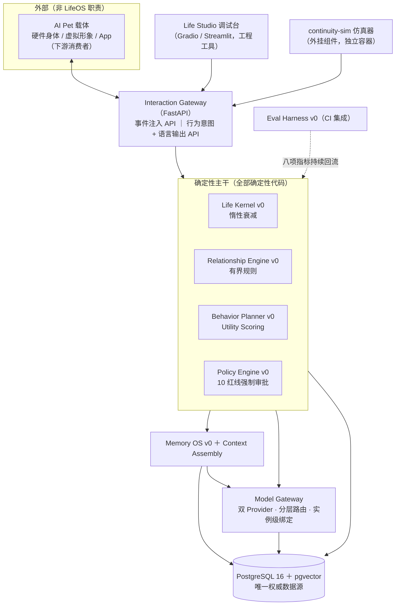
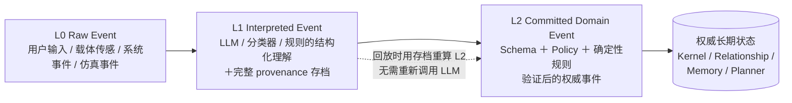
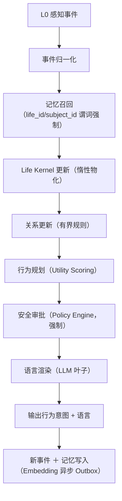

# LifeOS 架构设计 v0.9.1

**配套文档**：《LifeOS 产品规格说明书 v0.9.1》（验收口径与阈值以规格书为准，本文档不重复定义阈值）；《adadmic_innovation v0.9.1》（对标系统的完整景观）。

版本 v0.9.1 ｜ 2026-09-10 ｜ 相对 v0.9 增量修订：**每模块新增「对标系统」（业界近邻 top-3）与「输入/输出规格」**；新增 §5.11 continuity-sim 架构定位；`ConsentRecord` 增 `jurisdiction / locale`（多法域 P5）；其余继承 v0.9（A3/A4/A5/B6/B7/D5/D6 修订）。

> 本文档回答「怎么实现」。范围边界与规格书 §1.1 一致：LifeOS 是驱动 AI Pet 心智软资产（身份/记忆/人格/社会关系）的运行时，**不输出运动控制指令，不包含产品交互界面**。

**对标条目诚实声明**：各模块的「对标系统」为业界知名开源/商业系统的**名称与定位**（工程常识条目），用于说明选型理由与空白所在；它们**未经逐链接验证，不构成文献引用**（文献基线见 `adadmic_innovation_v0.9.1.md`，两者分列）；是否引入为依赖见规格书 §7 的裁剪立场。

---

## 1. 架构目标与约束

**目标**：

1. 换模型、换库、换载体后，Life Instance 仍是「同一个它」（规格书 H1/H3，判定框架见规格书 §1.3）；
2. 任何长期状态的来源可审计、可回放、可重算（重放一致率 100%）；
3. LLM 的能力被限制在「叶子」位置：生成候选、抽取、渲染，永不直写权威状态。

**硬约束**：

- 单一权威数据源：PostgreSQL 16 + pgvector；其他存储（Valkey 等）只允许做可重建的派生缓存；
- 所有写路径经 L0→L1→L2 事件管线，无后门写入；
- 全开源依赖（Apache-2.0 / MIT / BSD / PostgreSQL License），见规格书 §7；
- **部署形态**：单机 Docker Compose，**多 Life Instance 共库共存**，每实例串行事件队列；不上 K8s，不做跨机分布式（决策门前）。

---

## 2. 分层架构



**拓扑说明**：`DB` 是 CORE / MEM / MG 三者**共享的权威源**。Model Gateway 是**被调用的叶子服务**，不位于 Memory OS 与数据库之间。**continuity-sim（v0.9.1 新增入图）与载体、Studio 一样，都是 Gateway 的客户端**——它通过统一的事件注入 API 驱动系统，不进入核心依赖。

**多实例说明**：一个部署内多个 `LifeInstance` 共库共存；每实例一个串行事件队列（per-life FIFO）；跨实例隔离靠全部读写强制 `life_id` 谓词 + 隔离测试用例（§5.10、§7）。

**载体边界**：LifeOS 对载体只暴露 `POST /events`（注入 L0 事件）与 `GET /intent-stream`（结构化行为意图 + 已审批语言输出）。行为意图的 `modality` 字段仅为提示性枚举（`verbal / expressive / attentional`），**不含任何运动学参数**。

---

## 3. 三级事件模型（L0/L1/L2）

### 3.1 模型定义



**只有 L2 能修改** Life Kernel / Relationship Engine / Memory OS / Behavior Planner 的长期状态。

### 3.2 L1 provenance 存档（I3 的差异化核心）

每条 L1 事件必须存档以下字段，缺一不入库：

| 字段 | 说明 |
|---|---|
| `interpreter_type` | `llm / classifier / rule` |
| `model_provider` / `model_name` / `model_version` | LLM 解释时必填；版本冻结政策见规格书 §9.5 |
| `prompt_template_id` / `prompt_hash` | 提示模板标识与内容哈希 |
| `input_hash` | L0 事件内容哈希 |
| `output_json` | 结构化解释结果（Schema 校验前的原始输出） |
| `sampling_params` | temperature 等采样参数 |
| `extractor_version` | 解释器代码版本（git commit 或 SemVer） |
| `interpreted_at` | 解释时间戳 |

**与文献的边界**（诚实声明）：事件溯源 + LLM agent 的宏观架构已有 AgentRR（arXiv 2505.17716）、ActiveGraph（arXiv 2605.21997）、ESAA（arXiv 2602.23193）。本设计的增量**仅**在于：把「哪条解释由哪个模型/提示/代码版本产生」作为一等公民字段持久化，使 L2 重推导完全确定性、可逐条取证。

### 3.3 回放算法

```
replay(life_id, from_seq, to_seq):
    for event in l1_store.range(life_id, from_seq, to_seq):   # 按 L1 存档顺序
        l2 = deterministic_commit(event.output_json,          # 与在线路径同一函数
                                  schema_version=event.schema_version,
                                  policy_version=event.policy_version,
                                  rules_version=event.extractor_version)
        assert l2 == l2_store.get(event.l2_id)                # 一致性断言
```

- 在线路径与回放路径**调用同一个 `deterministic_commit` 函数**，禁止两套实现；
- 规则/策略/Schema 版本变更时，旧版本代码保留可执行（容器镜像固化），回放按事件当时版本执行；
- 验收：相同 L2 序列重放 100% 一致（规格书一票否决第 1 条）。

### 3.4 核心调用链



**LLM 边界**：可以做——生成候选行为意图、解释复杂场景、生成语言、记忆抽取；不可以做——绕过 Policy Engine、直接修改核心人格、覆盖关系状态、删除长期记忆、自主提权。

---

## 4. 数据模型（12 核心实体 + 3 支撑实体，阶段 0 冻结）

**v0.9.1 变更**：`ConsentRecord` 增 `jurisdiction / locale`（多法域 P5）。

| 实体 | 关键字段 | 说明 |
|---|---|---|
| `LifeInstance` | `life_id, born_at, personality_seed, schema_version, active_provider, status` | 生命实例根实体；`active_provider` 为实例级模型绑定 |
| `PersonalityContract` | `life_id, big_five_params, expression_style, frozen_at` | 人格契约，生成后冻结，变更走 ADR |
| `RawEvent` (L0) | `event_id, life_id, source, modality, payload, occurred_at` | 原始事件，不可变；`source` 含 `sim`（仿真事件与真人事件可区分） |
| `InterpretedEvent` (L1) | `event_id, raw_event_id, output_json, + §3.2 全部 provenance 字段` | 解释事件，不可变 |
| `DomainEvent` (L2) | `event_id, l1_event_id, event_type, payload, schema_version, policy_version, committed_at` | 权威事件，不可变 |
| `LifeState` | `life_id, state_key, value_at_last_update, last_updated_at, decay_function, decay_parameter, baseline, kernel_version` | 惰性衰减所需全部字段 |
| `MemoryRecord` | `memory_id, life_id, subject_id, type, content, slot_key, valid_from, valid_to, transaction_from, transaction_to, confidence, importance, emotional_weight, privacy_level, source_event_ids, conflict_state, version` | 双时态 + 冲突状态机；`subject_id` 可空，是场景二记忆隔离与「按人过滤」的依赖字段 |
| `RelationshipState` | `life_id, subject_id, familiarity, trust, attachment, updated_at, version` | 每关系实例一行，可回放重算 |
| `BehaviorIntent` | `intent_id, life_id, intent_type, modality, utility_score, reason, preconditions, status, created_at` | `reason` 为证据链 JSON；`status ∈ {proposed, approved, rejected, executed}` |
| `PolicyDecision` | `decision_id, intent_id, rules_hit, result, overridden_by, decided_at` | 审批留痕 |
| `ModelInvocation` | `invocation_id, life_id, provider, model, model_version, tokens, latency_ms, cost_usd, purpose, called_at` | 逐笔成本与版本记录 |
| `EvaluationRun` | `run_id, gold_set_id, gold_set_version, model_version, metrics_json, ci_pass, ran_at` | 评估留痕 |
| `ConsentRecord`（支撑） | `consent_id, external_user_id, life_id, consent_type, scope, jurisdiction, locale, document_version, granted_at, revoked_at` | 知情同意全程留痕；**`jurisdiction / locale` 支撑多法域 × 多语言模板版本化（v0.9.1）**；append-only；阶段 3 前激活 |
| `GoldSetRegistry`（支撑） | `gold_set_id, kind, version, item_count, content_hash, frozen_at, notes` | 评估材料注册表；**`kind ∈ {core_facts, memory_extraction, persona_probe, behavior_scenario, human_gold, synthetic_labeled}`**——人工标尺与 sim 合成标注分开注册、分报指标（规格书 §4.6/§9.2） |
| `EmbeddingOutbox`（支撑） | `outbox_id, memory_id, embedding_model_version, status, retry_count, created_at, embedded_at` | 异步嵌入 Outbox；版本冻结记录；`status` 可更新（幂等重试） |

**不变式**：

- `RawEvent / InterpretedEvent / DomainEvent` 三表只插不改（append-only）；
- 权威状态表（`LifeState / RelationshipState / MemoryRecord`）只能由 L2 事件处理函数写入；
- `MemoryRecord` 冲突解决不删除历史版本——**唯一例外是用户擦除**（§5.2 两级删除语义）；
- `ConsentRecord` append-only；`EmbeddingOutbox` 仅 `status/retry_count/embedded_at` 可更新；
- 全部实体含 `life_id` 谓词（多实例隔离的物理基础）。

---

## 5. 核心模块设计（v0.9.1：每模块含对标系统 + 输入/输出规格）

### 5.1 Life Kernel v0

**对标系统（top-3）**：
1. **FAtiMA Toolkit**（开源，INESC-ID）——经典情感 agent 架构（appraisal + 记忆 + 行为），本项目借鉴其「情感评估→状态」的分层思路；
2. **OCC 情感模型**（Ortony/Clore/Collins 1988 学术范式，有多个开源实现）——valence/arousal 二维情绪的语义来源之一；
3. **SOAR**（密歇根大学，认知架构）——「确定性产生式规则 + 工作记忆」的架构参照。
均无「惰性衰减的外部化状态核 + 回放可重算」的直接对等物——这正是自研的理由。

**输入规格**：
- L2 `DomainEvent`：`{event_type, state_delta: {state_key: delta}, confidence, committed_at}`（state_delta 由确定性规则从 L1 抽取的情绪/事件字段聚合而来，规格书 §6）；
- 物化触发请求：`{life_id, trigger: event|plan|snapshot|eval|export}`。

**输出规格**：
- 物化状态：`{life_id, states: {energy, social_need, security, curiosity, playfulness}, valence, arousal, materialized_at}`（各值 ∈ [0,1]，惰性衰减公式物化）；
- 创建时一次性输出：`PersonalityContract`（由 `personality_seed` 确定性派生，写入后冻结）。

- 状态：`energy / social_need / security / curiosity / playfulness`（阶段 1 先 3 个）+ `valence / arousal`；
- 惰性衰减：`x(t) = b + (x(t0) − b)·e^(−λ(t−t0))`；仅在新事件到达、规划、快照、评估、导出时物化，无后台写轮询；
- 人格参数：`personality_seed` 确定性派生（同一种子必得同一组参数），冻结于 `PersonalityContract`；
- 技术方法：有限状态机 + 离散动态系统（transitions / NumPy / Pydantic）；
- **明确不做**：状态空间模型、HMM、个体参数学习、在线学习、因果模型（设计理由见规格书 §6.1：回放确定性、契约冻结语义、合规负担、最小可证伪核心）。

### 5.2 Memory OS v0

**对标系统（top-3）**：
1. **Mem0**（开源记忆层）——LLM 应用记忆的抽取/更新/检索，冲突处理依赖 LLM 判断（I4 对位）；
2. **Letta（原 MemGPT）**（开源）——分页式记忆与自编辑记忆，假定模型固定；
3. **Zep / Graphiti**（开源 + 商业）——双时态知识图谱记忆（arXiv 2501.13956），本项目借鉴其时间模型。
均无「写入路径无 LLM 裁判 + ambiguous 人工队列 + 双时态 supersedes」组合（I4 空白）。

**输入规格（写入路径）**：
- L1 `InterpretedEvent`：含结构化记忆候选 `[{type: episodic|semantic, content, slot_key?, subject_id?, emotion: {valence, arousal}, confidence, importance, privacy_level}]`；
- 用户操作：`remember / revise / delete / export / explain` 请求（带 `life_id` 与操作者身份）。

**输入规格（召回路径）**：
- `RecallQuery = {life_id, subject_id?, query_text, time_range?, memory_type?, top_k, include_ambiguous: false}`——`life_id` 无条件强制，`subject_id` 人物相关查询强制。

**输出规格**：
- 写入：`MemoryRecord` 行（双时态字段 + `conflict_state ∈ {current, superseded, ambiguous, coexists}`）；
- 召回：`RecallBundle = {memories: [{memory_id, content, type, score, valid_from, conflict_state}], filters_applied, total_candidates}`（ambiguous 记忆降权并标注）；
- 删除：擦除回执 `{erased_memory_ids, index_rebuild_verified: true}`（两级删除语义见下）。

**写入管线**：`Raw Event → L1 抽取（LLM，结构化输出）→ Schema 校验 → 重复检测 → 槽位冲突规则（确定性）→ Policy 校验 → L2 Commit → PostgreSQL ↘ EmbeddingOutbox（含 embedding_model_version）→ Embedding Worker（异步）`。

**召回管线**：`Context → life_id / subject_id / 时间 / 类型 SQL 过滤 → pgvector 精确检索 → Reranking → Context Assembly`。先精确检索，P95 不达标才评审引入 HNSW。

**同槽位冲突的确定性时态治理（I4）**：

- 语义记忆带 `slot_key`（如 `user.pet_name`）；同槽位新事实到达时：
  - LLM 只**提议** `{slot, old, new, relation, confidence}`，`relation ∈ {update / contradict / coexists}`；
  - **规则裁决**（非 LLM）：`update` 且 confidence ≥ 阈值 → 旧版本 `transaction_to = now`、`conflict_state = superseded`；`contradict` 或 confidence 不足 → 双版本并存、`conflict_state = ambiguous`、进人工确认队列、召回降权标注；`coexists` → 双版本共存；
  - 置信度阈值初始值待阶段 1/2 校准（暂无依据设定具体数值，走 ADR）；
- 双时间：`valid_from/valid_to` 与 `transaction_from/transaction_to`；
- **与文献的对位**：双时态建模来自 Graphiti/Zep；裁决算子已被 TOKI（arXiv 2606.06240）形式化；STALE（arXiv 2605.06527）证明 LLM 自判冲突仅 ~55% 准确率。差异化仅剩：**写入路径无 LLM 裁判 + ambiguous 第三态进人工队列**。实现时直接参考 TOKI 算子语义。

**两级删除语义**：

1. **治理性失效**：bitemporal supersede/expire，历史保留；
2. **用户擦除**（红线第 10 条）：物理删除权威记录 + 向量/全文索引 + 缓存，全介质清除并自动验证不可恢复（一票否决第 5 条）；擦除的 L2 事件只含 `memory_id` 与操作元数据；append-only 表中的历史内容片段按 30 天滚动备份窗口（暂定，ADR）消亡，备份加密，同意书中披露。

### 5.3 Relationship Engine v0

**对标系统（top-3）**：
1. **Mesa**（开源 ABM 框架）——agent 社会仿真基础设施，本项目参照其「关系作为一等状态」的建模；
2. **Concordia**（Google DeepMind 开源）——LLM 社会仿真中 agent 间关系的社会语境机制；
3. **游戏关系系统**（如《十字军之王》意见值体系，闭源商业）——「数值化关系 + 事件修正量」的成熟产品实践。
均无「事件驱动 + 每关系一行 + 全参数版本化可回放重算」的生产实现对等物。

**输入规格**：
- L2 `DomainEvent`：`{event_type, subject_id, confidence}`（事件类型 → 权重表 `w_e` 查询）；
- 人格调制系数 `p`（来自 PersonalityContract）。

**输出规格**：
- `RelationshipState` 行：`{life_id, subject_id, familiarity, trust, attachment}`（各 ∈ [0,1]）；
- 关系得分向量（Behavior Planner 打分与 Context Assembly 组装的输入）；
- 版本化参数表（`kernel_version`），保证回放重算。

- 更新规则：`r_{t+1} = clip(r_t + w_e · p · c − λ·Δt, 0, 1)`；
- 记忆隔离：召回 SQL 过滤强制带 `subject_id` 谓词（场景二验收点）。

### 5.4 Behavior Planner v0

**对标系统（top-3）**：
1. **py_trees / BehaviorTree.CPP**（开源行为树）——游戏与机器人标配；本项目延后引入（行为 >15 或需中断恢复时再评审）；
2. **LangGraph**（开源图编排）——通用 agent 编排；不进关键路径（编排自由度与确定性诉求冲突）；
3. **Utility AI / GOAP 游戏范式**（行业实践）——本项目选 Utility Scoring：候选集小、打分函数封闭、天然产出 `reason` 证据链。

**输入规格**：
- 当前物化状态快照（来自 Life Kernel）；
- 关系得分向量（ Relationship Engine）；
- `PersonalityContract`（人格调制）；
- 候选意图注册表（6～12 个，枚举 + 各意图前置条件）+ 冷却时间表。

**输出规格**：
- `BehaviorIntent = {intent_id, life_id, intent_type, modality: verbal|expressive|attentional, utility_score, reason: {每个候选的得分分解}, preconditions, status: proposed}`；
- 经 Policy 审批后 `status → approved/rejected`；渲染完成后 `status → executed`；
- **不含任何运动学参数**（载体边界）。

### 5.5 Policy Engine v0

**对标系统（top-3）**：
1. **OPA（Open Policy Agent）**（CNCF 开源）——通用 policy-as-code（Rego），本项目借鉴其「策略即代码 + 决策留痕」；
2. **AWS Cedar**（AWS 开源）——类型化策略语言 + 可验证性；
3. **NVIDIA NeMo Guardrails**（开源）——LLM 对话护栏（rails 定义 + 拦截）。
均无「依恋安全红线集 + 行为意图审批语义 + `PolicyDecision` 全量留痕」——I6 空白。自研轻量规则引擎（数百行）而非引入 OPA：策略数量小（10 红线）、语义领域特定、依赖最小化。

**输入规格**：
- 候选 `BehaviorIntent`（status=proposed）+ 当前状态上下文摘要；
- 版本化策略规则集（代码 + YAML 配置，变更走 ADR）。

**输出规格**：
- `PolicyDecision = {decision_id, intent_id, result: approve|reject, rules_hit: [rule_id], reason(结构化), decided_at}`；
- **拒绝时零状态副作用**（审批发生在事务开启前，Gate 0 验收点）；
- 人工覆盖通道：留痕并计高危审计事件。

### 5.6 Model Gateway

**对标系统（top-3）**：
1. **LiteLLM**（开源）——多 Provider 统一网关；本项目不作为核心依赖，仅可作对照；
2. **OpenRouter**（商业路由）——多模型路由与计费；
3. **Portkey**（商业 + 开源网关）——LLM 网关与可观测。
自研轻量 Adapter 的理由：需要**逐笔 provenance 与确定性路由**（通用网关的遥测粒度不够：无法绑定 `prompt_template_id`/`extractor_version` 到每笔调用）。

**输入规格**：
- `generate(prompt_bundle, sampling_params, provider_profile)`——语言渲染；
- `extract(l0_event, prompt_template_id, output_schema)`——记忆/情绪抽取（结构化输出）；
- `embed(texts, embedding_profile)`——嵌入；
- `switch(life_id, target_provider)`——实例级切换指令。

**输出规格**：
- 补全/抽取 JSON / 向量（按接口）；
- `ModelInvocation = {invocation_id, life_id, provider, model, model_version, tokens, latency_ms, cost_usd, purpose, called_at}`——逐笔落库；
- 切换：系统 L0 事件 + 切换前后 `RelationshipState / Identity` 断言零变化（一票否决第 6 条）；
- Embedding 模型版本经 `EmbeddingOutbox.embedding_model_version` 记录（版本冻结，规格书 §9.5）。

### 5.7 Context Assembly

**对标系统（top-3）**：
1. **LangChain / LlamaIndex**（开源）——通用提示组装与检索编排；
2. **DSPy**（开源）——提示编译与优化范式；
3. **Letta**（开源）——记忆到提示的组装实践。
通用组装能力均有现成物；本项目的特殊约束是**纯函数化 + 模板版本化 + 同快照同 prompt**（跨模型一致率测量的前提），因此自研轻量组装器。

**输入规格**：
- `PersonalityContract` + 状态摘要（Kernel 快照）+ `RecallBundle`（Memory OS）+ 关系得分向量 + 行为意图约束 + `prompt_template_id`（版本化模板）。

**输出规格**：
- 最终 System Role 字符串 + `{prompt_template_id, prompt_hash}`（存档，支撑跨模型一致率测量与 gold set 报告标注）。

### 5.8 Life Studio v0（调试台）

**对标系统（top-3）**：
1. **Langfuse**（开源 LLM 观测）——trace/评估/数据集管理；
2. **Arize Phoenix**（开源）——LLM 可观测与评估；
3. **LangSmith**（商业）——调试与评估平台。
观测能力可借鉴其信息架构；「实例状态面板 + 记忆回放取证 + 事件注入」的领域功能需自建（Gradio 之上薄层）。

**输入规格**：操作者指令（创建实例 / 注入事件 / 触发回放 / 触发评估 / 查看状态）。

**输出规格**：转化为公开 API 调用；展示视图（状态面板、记忆回放、评估面板、sim 跑批报告可视化）。

**与 continuity-sim 的关系**（规格书 §6.7）：同一 API 面上的两种驱动方式——Studio 是人在回路的手动调试工具，sim 是无人值守数据源；sim 可作为 Studio 的「批量注入」后端，sim 报告在 Studio 面板可视化。

### 5.9 Eval Harness v0

**对标系统（top-3）**：
1. **DeepEval**（开源）——LLM 断言与指标（技术栈已选）；
2. **Ragas**（开源）——RAG 指标（技术栈已选）；
3. **Promptfoo**（开源）——提示回归与红队（技术栈已选）。
八项连续性指标为自定义实现（现成框架无此指标族）；**盲测工具（预注册 + 被试内配对 + bootstrap CI）无现成对等物，自建**。

**输入规格**：
- 系统输出样本（各臂完整管线产出）；
- gold set（经 `GoldSetRegistry` 引用 `gold_set_id + version`，`kind` 区分 human_gold / synthetic_labeled）；
- 回放请求 `{life_id, from_seq, to_seq}`。

**输出规格**：
- `EvaluationRun = {run_id, gold_set_id, gold_set_version, model_version, metrics_json(八项), ci_pass, ran_at}`；
- 盲测分析报告：各臂一致率 bootstrap 95% CI + 配对差值 CI + 编码一致性（κ）；
- 回放一致性报告（逐事件比对结果）。

### 5.10 安全运维基线

- **API 鉴权**：全部端点要求部署级 Bearer token；决策门前不暴露公网；
- **密钥管理**：Provider API key 经环境变量 / secret 文件注入，不入库、不入日志、不入仓库；
- **审计日志访问控制**：`PolicyDecision / ModelInvocation / ConsentRecord` 访问受控，导出走双人审批；
- **多实例隔离验收**：自动化测试断言「跨 life_id 召回/读取必为空」；
- **DB 最小权限**：应用账号与迁移账号分离；备份文件加密存储。

### 5.11 continuity-sim v0（v0.9.1 新增：架构定位与 IO 规格）

**对标系统（top-3）**：
1. **Concordia**（Google DeepMind 开源库）——LLM agent 社会仿真（组件化 agent + 仿真母环）；
2. **Generative Agents**（斯坦福，arXiv 2304.03442）——记忆流 + 反思 + 计划的小镇仿真范式；
3. **AgentSociety**（开源）——LLM 驱动的大规模社会仿真。
均无「时间加速 + 面向连续性的注入算子（分离/重逢/纠正/冲突）+ 全种子化」的现成物——这是自建的理由；借鉴其 persona 驱动对话生成的成熟做法。

**架构定位**：**外挂组件**——独立容器/进程，唯一交互面是 LifeOS 公开 API（`POST /events` 注入 L0 事件、`GET /state` 读取快照）；不进入核心依赖；产出的事件在 `RawEvent.source` 中标记 `sim`，与真人事件可区分。

**输入规格**：
- 仿真配置：`{persona_spec, schedule_skeleton(脚本化日历), operators: {separation, reunion, correction, conflict, preference_shift} 的类型与概率, time_scale: 1真实日≈30模拟日, seed}`（全参数种子化）。

**输出规格**：
- L0 事件流（经事件导入适配器，Schema 与真人事件完全一致）；
- 带真值的合成标注材料（注入事件即真值，注册为 `GoldSetRegistry.kind = synthetic_labeled`）；
- 连续性报告（每周自动：记忆量爬坡、错误率/冲突率趋势，供 H2 测量与 Studio 面板）。

**效度局限**：LLM 合成对话存在风格单一与分布偏差；H2 结论限定于合成分布（规格书 §4.6）。

---

## 6. 接口契约（对外 API 摘要）

| 端点 | 用途 | 备注 |
|---|---|---|
| `POST /instances` | 创建 Life Instance | 返回 life_id 与人格契约 |
| `POST /events` | 注入 L0 事件 | 载体、调试台、continuity-sim 共用入口（sim 事件 `source=sim`） |
| `GET /intent-stream` | 行为意图 + 语言输出 | WebSocket/SSE；输出类型冻结为结构化意图 |
| `GET /state/{life_id}` | 当前状态快照 | 触发惰性物化；返回 `{kernel_states, valence_arousal, relationships[], memory_summary, active_provider}` |
| `POST /memories/{op}` | `remember/recall/revise/delete/export/explain` | `delete` = 用户擦除，触发索引重建验证 |
| `POST /model/switch` | 模型热切换 | body 含 `life_id` 与 `target_provider`（实例级）；记录系统事件，前后状态断言 |
| `POST /replay/{life_id}` | 回放取证 | 输出一致性报告 |
| `GET /eval/runs` | 评估结果 | CI 与调试台共用 |

**鉴权**：全部端点要求 Bearer token（§5.10）；契约即文档：OpenAPI 自动生成，变更走 ADR。

---

## 7. 事务、并发与一致性

- L2 Commit 与其引发的状态写、记忆写在**同一数据库事务**内；失败整体回滚，不留半截状态；
- Policy 拒绝发生在事务开启前（无副作用保证）；
- Embedding 为唯一异步环节（Outbox + Worker 重试），Embedding 失败不影响权威事实可用性，仅影响向量召回质量（降级为 SQL 过滤召回）；
- **多实例并发模型**：每实例一个串行事件队列（per-life FIFO），实例内无事件级并发；跨实例无共享可变状态；全部状态读写强制 `life_id` 谓词，隔离性由 §5.10 测试用例验收；
- 并发瓶颈出现时按需引入 Valkey（规格书 §7），仍不引入跨机分布式。

## 8. 部署架构

- 单机 Docker Compose：`app（FastAPI 单体）/ postgres+pgvector / embedding-worker / eval-runner / studio（Gradio）/ continuity-sim（阶段 2 起，外挂）/ otel-collector + prometheus + jaeger`；
- **多实例共存**：同一部署承载多个 `LifeInstance`；实例数量上限决策门前不作为优化目标，隔离正确性优先；
- 本地推理节点（阶段 1 起）：vLLM 或 llama.cpp 独立容器/主机，作为 Provider B；最低配置清单列入 Gate 0 环境检查项；
- 备份：PostgreSQL 每日逻辑备份 + WAL 归档；append-only 三表按「不可丢失」等级管理；备份加密，保留窗口与用户擦除的衔接语义见 §5.2 与规格书 §9.3（30 天滚动窗口，暂定，ADR）。

## 9. 明确不做（架构层）

- 不输出运动控制指令、不做载体适配层；
- 不做多租户 SaaS 化、不做 K8s、不做微服务拆分、不做跨机分布式与实例级弹性调度（决策门前；多实例共库共存属本版范围）；
- 不引入 Temporal / LangGraph / Qdrant / Next.js / py_trees（触发条件见规格书 §7，按需评审）；
- 不做在线学习与个体参数学习（理由见规格书 §6.1）；
- 不自研评估框架与观测栈；
- **continuity-sim 不做第三方引擎适配器**（阶段 2 可选项，不阻塞任何 Gate；引入须 ADR + round-trip 测试套件）。

---

## 10. 与现有文献/系统的技术对位速查

| 他们的 | 我们的 | 关系 |
|---|---|---|
| Graphiti/Zep 双时态知识图谱（arXiv 2501.13956） | 双时态字段 + 规则裁决状态机（PostgreSQL 行存，非图库） | 借鉴时间模型；不引入图依赖；裁决不用 LLM |
| TOKI 双时态算子代数（arXiv 2606.06240） | 槽位冲突规则（§5.2） | 直接参考其算子语义实现；我们补 ambiguous→人工队列 |
| AgentRR / ActiveGraph / ESAA（事件溯源） | L0/L1/L2 + provenance 存档（§3） | 宏观架构同源；增量仅在逐条解释级 provenance |
| Portable Agent Memory（arXiv 2605.11032） | Life Instance Schema + 导出（§4、§6） | 可作 Baseline D 对照；我们补连续性治理与量化 |
| Mem0 / Letta | 对照实验对象 | 不进权威路径（规格书 §7） |
| Concordia / Generative Agents / AgentSociety（仿真） | continuity-sim（§5.11） | 借鉴 persona 对话生成；我们补时间加速 + 连续性注入算子 + 种子化 |
| OPA / Cedar / NeMo Guardrails（策略） | Policy Engine（§5.5） | 借鉴 policy-as-code；我们补依恋安全红线集与审批留痕语义 |
