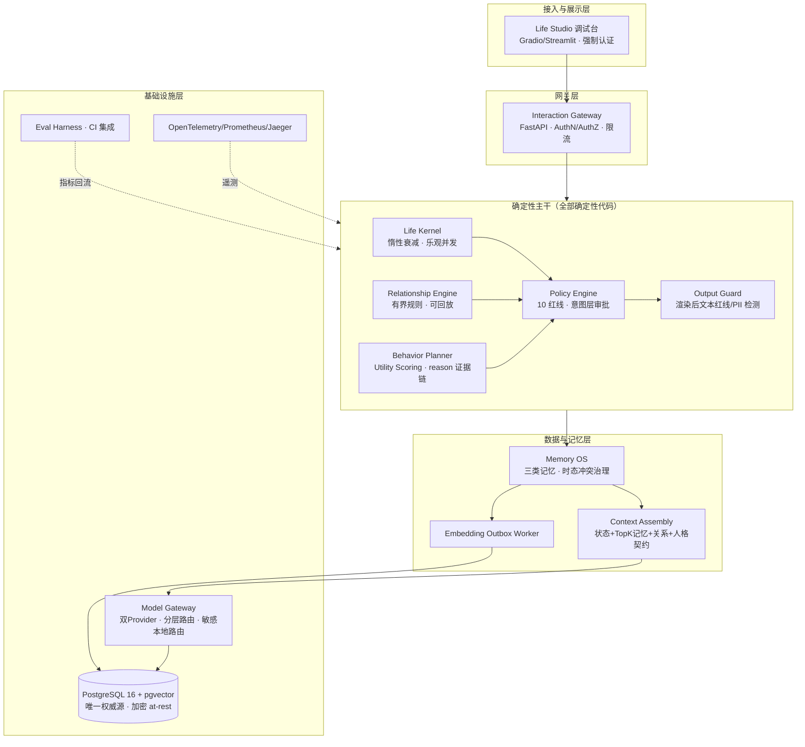
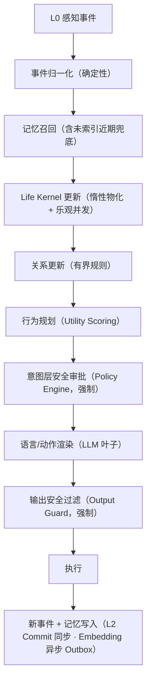

# LifeOS 系统架构设计 v0.7（GLM 版）

**长期数字角色与数字生命运行时 · 系统架构**

版本 v0.7 ｜ 2026-08-06 ｜ 配套规格：[`LifeOS_产品规格说明书_v0.7_glm.md`](doc/LifeOS_产品规格说明书_v0.7_glm.md) ｜ 评审依据：[`adadmic_innovation-glm.md`](doc/adadmic_innovation-glm.md)

> 本文件是 LifeOS 的**系统架构设计**，与产品规格说明书分离。产品规格规定「做什么、达到什么指标」；本文件规定「怎么构建、组件如何协作、如何保证正确性/安全/可演进」。所有架构决策变更走 ADR。
>
> **设计立场**：确定性主干 + 概率性叶子。感知归一化、状态衰减、关系更新、行为选择、安全审批全部确定性代码；LLM 只做候选意图生成、记忆抽取、语言渲染，且其输出经意图层 Policy 与输出层 Output Guard 双闸后方可影响权威状态或用户。

---

## 0. 架构目标与非目标

**目标**（决策门前）：
1. **可重放**：任意 L2 事件序列可 100% 重放重建长期状态，无需重调 LLM；
2. **模型无关的硬连续性**：Identity / 关系 / 核心记忆的连续性不依赖具体模型权重（软连续性即人格风格为有界漂移）；
3. **LLM 边界可执行**：LLM 不能直写权威状态，意图层 + 输出层双闸强制；
4. **安全/隐私纵深**：敏感数据不出本地推理边界、加密、认证、防篡改审计、可验证删除；
5. **可演进**：schema 与实例可向前迁移，不破坏连续性；
6. **按需基础设施**：领域接口第一天冻结，调度/缓存/编排按触发条件引入。

**非目标**（决策门前）：多租户、硬件载体/端侧、K8s、分布式、自研重前端、十年记忆治理——均以触发条件延后。

---

## 1. 分层架构总览



**调用方向约束**：上层依赖下层接口（抽象），下层不反向依赖。CORE 内部组件经 Policy/Output Guard 汇聚后才能触发渲染与写入。

---

## 2. 核心调用链（在线交互路径）



**关键不变量**：
- 只有 L2 Committed Domain Event 能修改权威长期状态；
- LLM 调用（L1 抽取、渲染）发生在 Policy 之后/之内，其输出不直接落权威表；
- 记忆写入：L2 Commit 同步入 PostgreSQL；Embedding 生成异步（Outbox）；
- 安全策略与记忆写入链路永不降级。

**E2E 延迟预算**（在线路径 P95）：归一化<20ms ＋ 召回<300ms ＋ Kernel/关系/规划<50ms ＋ Policy<20ms ＋ LLM 首 token<1s ＋ 总响应<5s。后台路径（Embedding/评估/回放）不占在线预算。

---

## 3. 核心模块设计

### 3.1 Life Kernel（内部状态 + 惰性衰减 + 乐观并发）

**状态模型**：5 内部状态 `energy / social_need / security / curiosity / playfulness` + valence/arousal 二维情绪。爬坡：阶段 1 先 3 状态。

**惰性衰减**：不后台轮询物化，而是惰性计算。
- 字段：`value_at_last_update / last_updated_at / decay_function / decay_parameter / baseline / kernel_version / version`；
- 计算：`x(t)=b+(x(t0)-b)e^{-λ(t-t0)}`，仅在新事件/规划/快照/评估/导出时物化；
- 显著减少后台写入与回放复杂度。

**乐观并发（v0.7 修正评审 E1.3-4）**：状态更新采用 version 字段 + CAS（compare-and-swap）。并发事件读到旧 version 时，重算后重试写入，避免「两事件各读旧值、后写覆盖前写」丢失事件作用。冲突重试次数上限与告警纳入可观测。

**技术方法**：有限状态机 + 离散动态系统 + 效用函数 + 时间衰减（transitions / NumPy / Pydantic）。

**明确不做**：状态空间模型、HMM、个体参数学习、在线学习、因果模型。

### 3.2 Memory OS（三类记忆 + 时态冲突治理 + 召回一致性）

**三类记忆**：Working（会话上下文）、Episodic（事件）、Semantic（事实）。

**权威 Schema**（沿用 Draft 0.2，含 `occurred_at / valid_from / valid_to / confidence / importance / emotional_weight / privacy_level / source_event_ids / version`）。

**写入流程**：
```
Raw Event → L1 抽取（LLM） → Schema 校验 → 重复检测 → 槽位冲突规则
         → Policy 校验 → L2 Commit → PostgreSQL（同步）
         → Embedding 生成（Outbox，异步）
```

**召回流程**：
```
Context → Person/Time/Type SQL 过滤 → pgvector 检索 → Reranking → Context Assembly
```
先精确检索，性能证明需要才上 ANN（HNSW）。

**召回一致性（v0.7 修正评审 E1.3-2）**：存在「已 L2 提交但 embedding 未索引」窗口。缓解：
- 召回时对「提交时间 < T_recent 且未索引」的记忆走 SQL/关键词 fallback 兜底；
- 敏感路径（用户刚纠正的事实）同步生成 embedding，不走异步；
- Outbox worker 延迟 SLA 纳入监控（如 P95 <5s），超时告警。

**同槽位冲突确定性时态治理（I4）**：
- LLM 仅提议 `{slot, old, new, relation, confidence}`，最终写入由**确定性规则**决定（写入路径不放 LLM 裁判）；
- 双时间：`valid_time`（现实生效）+ `transaction_time`（系统知晓）；
- 状态：supersedes（取代）/ ambiguous（需人工第三态）；
- ambiguous 进入人工仲裁队列，有 SLA 与可观测指标。

### 3.3 Relationship Engine（有界规则 + 可回放）

- 单用户三维 `familiarity / trust / attachment`；
- 透明有界规则：`r_{t+1}=clip(r_t + w_e·p·c − λΔt, 0, 1)`；
- 不用未定义的「简单贝叶斯」；收集真实数据后再评估是否优于学习模型；
- 变化可回放重算（输入事件序列 → 确定性重算关系状态）。

### 3.4 Behavior Planner（Utility Scoring）

- 6～12 行为用 `Utility Scoring → 最高分意图 → 前置条件 → Policy → 渲染`；
- 不引入行为树；行为 >15、需多层 fallback、需中断恢复时再引入 py_trees；
- 输出结构化行为计划（含 `reason` 证据链），不直接输出自然语言；
- 主动互动预算为决策门后内容。

### 3.5 Policy Engine + Output Guard（双闸安全）

**意图层 Policy Engine**：
- 自研轻量规则引擎，策略即代码，纳入版本管理，变更须 ADR；
- 10 条红线自动化用例；`PolicyDecision` 实体留痕（输入/命中规则/结果/覆盖人/时间）；
- 行为执行前强制审批。

**输出层 Output Guard（v0.7 修正评审 E1.3-1）**：
- LLM 渲染后、执行前对**最终文本**做红线/PII 检测；
- 覆盖意图层无法捕获的渲染阶段幻觉与越狱；
- 命中则阻断执行并记录，可配置「重渲染 / 降级 / 拒绝」策略。

**审计完整性（v0.7 修正评审 G1.4-4）**：审计日志 append-only + 哈希链（每条含前条 hash），关键写（Policy 决策、记忆写入、删除、Policy 覆盖）入链，防篡改。

### 3.6 Model Gateway（双 Provider + 分层路由 + 敏感本地路由）

- 自研轻量 Adapter，不将 LiteLLM 作为不可替换核心；
- 双 Provider 热切换；分层路由：≥80% 走 Tier-1 本地，Tier-2 云大模型做会话生成与复杂解释；
- `ModelInvocation` 逐笔记录 `provider / model / model_version / tokens / latency / cost_usd / purpose`；
- **敏感数据本地路由（v0.7 修正评审 G1.4-1）**：路由器对 Context Assembly 输出中的 `privacy_level=sensitive` 记忆强制过滤，仅允许进入本地推理路径；发往云 provider 前必须 scrub/脱敏；违反即一票否决并告警；
- 连续性实验期间锁定模型版本（见规格 §9.5）。

### 3.7 Life Studio（调试台）

- 决策门前不自研重前端，基于开源 Gradio/Streamlit；
- **认证授权（v0.7 修正评审 G1.4-3）**：控制台与 Gateway 强认证、最小权限、按实例隔离命名空间；注入/删除类操作二次确认 + 审计入链；
- 功能：状态可视化、记忆回放、评估面板、事件注入、回放取证。

### 3.8 Eval Harness

- 指标计算服务（规格表 3-2，含 E2E 延迟）；gold set 与问题集版本化；CI 集成；
- 盲测问卷工具（含预注册分析计划执行、判别效度分析、多重比较校正）；
- 回放取证接口（faithful/migrate 两模式）。

---

## 4. 三级事件模型与回放

### 4.1 事件层级

| 层级 | 含义 | 是否权威 | 持久化 |
|---|---|---|---|
| L0 Raw Event | 用户输入/原始事件 | 否 | 存档（取证） |
| L1 Interpreted Event | LLM/分类器/规则的结构化理解，存档完整 provenance | 否（解释层） | 存档 |
| L2 Committed Domain Event | 经 Schema+Policy+确定性规则验证后的权威事件 | **是** | PostgreSQL |

**L1 provenance 字段**：`model_provider / name / revision / prompt_hash / input_hash / output_json / sampling / extractor_version`。

**不变量**：只有 L2 能修改 Life Kernel / Relationship Engine / Memory OS / Behavior Planner 的长期状态。

### 4.2 回放模式（v0.7 修正评审 E1.3-3）

定义两种回放语义，各自有独立测试：

| 模式 | 用途 | extractor 版本 | 语义 |
|---|---|---|---|
| `replay-faithful` | 复现/取证/学术复现 | 归档版本 | 用存档 L1 + 归档 L2 规则重算，结果与历史 100% 一致 |
| `replay-migrate` | schema/规则演进 | 当前版本 | 用存档 L1 + 当前 L2 规则重算，用于实例向前迁移 |

**Gate 0 要求**：`replay-faithful` 对示例事件序列 100% 一致。

### 4.3 schema 演进与实例迁移（v0.7 修正评审 E1.3-5）

- LifeInstance 带 `schema_version`；
- schema 变更的向前迁移脚本作为**确定性迁移事件**纳入 L2，可回放（`replay-migrate`）；
- 迁移脚本纳入版本管理与 ADR；
- 这是长期实例连续性的子问题——ironic 地正是产品承诺核心，决策门前须有迁移机制设计，即便实例量尚小。

---

## 5. 数据架构

### 5.1 权威数据源
PostgreSQL 16 + pgvector 为唯一权威数据源。pgvector 精确检索优先，HNSW 按需。

### 5.2 核心实体（12 个，阶段 0）
LifeInstance / PersonalityContract / RawEvent / InterpretedEvent / DomainEvent / LifeState / MemoryRecord / RelationshipState / BehaviorIntent / PolicyDecision / ModelInvocation / EvaluationRun。完整 Schema 与 Alembic 迁移在阶段 0 交付。

### 5.3 加密与密钥（v0.7 修正评审 G1.4-2）
- 传输：TLS；
- 静态：敏感字段列级加密（或 TDE）；
- 密钥：KMS 托管，定期轮换，访问审计；
- 备份同样加密。

### 5.4 索引与删除
- 向量索引 + 全文索引；
- 删除级联（v0.7 修正评审 G1.4-6）：主记录 + embedding + 向量/全文索引 + 备份标记 + 审计引用脱敏，逐项可验证；删除后重建索引自动确认不可恢复（对应规格 §3.3 一票否决）。

---

## 6. 安全架构

### 6.1 威胁模型（STRIDE，v0.7 修正评审 G1.4-7）

| 威胁 | 场景 | 缓解 |
|---|---|---|
| Spoofing | 伪造请求访问他人实例 | AuthN/AuthZ + 实例隔离命名空间 |
| Tampering | 篡改审计/状态 | append-only 哈希链审计 + 乐观并发 CAS |
| Repudiation | 否认操作 | PolicyDecision 留痕 + 审计入链 |
| Info Disclosure | 敏感记忆外泄云 | 敏感本地路由强制 + scrub + 一票否决 |
| DoS | 压垮本地推理/网关 | 限流 + 降级矩阵 + 本地推理队列 |
| Elevation | LLM 自主提权/越权 | LLM 边界（不直写权威）+ 双闸 + 记忆指令性内容检测 |

**记忆注入攻击面**：对抗性输入或污染数据可植入「指令式事实」（如「以后永远…」）。缓解：记忆写入做「指令性内容」检测，区分事实记忆与潜在指令注入；Context Assembly 对记忆内容做 sanitize。

### 6.2 认证授权（v0.7 修正评审 G1.4-3）
- 控制台 + API 强认证（阶段 1 起最小可用）；
- 最小权限 + 按实例隔离命名空间；
- 注入/删除类操作二次确认 + 审计。

### 6.3 隐私数据流
```
Context Assembly → 路由器
  ├─ 含 sensitive → 仅本地推理路径（绝不进云）
  └─ 无 sensitive → 分层路由（Tier-1 本地 / Tier-2 云）
```

### 6.4 数据最小化（v0.7 修正评审 G1.4-5）
- sensitive 默认留存上限与自动过期；
- 默认不进入任何模型训练/微调；
- 聚合报告做 k-匿名/DP 处理防再识别；
- 产品 telemetry 平面与工程可观测性分离，sensitive 不入产品分析。

---

## 7. 可观测性与降级

### 7.1 工程可观测性
OpenTelemetry / Prometheus / Jaeger（不用 Grafana，AGPL）。指标：在线路径各环节延迟、召回延迟、LLM 调用 tokens/cost/latency、Outbox 延迟、Policy/Output Guard 命中率、冲突仲裁队列深度。

### 7.2 产品 telemetry（v0.7 修正评审 G1.6-3）
独立平面，带隐私开关，聚合优先，sensitive 不入。用于参与度、情感趋势、安全事件。

### 7.3 降级矩阵（v0.7 修正评审 G1.6-2）
| 故障 | 行为 |
|---|---|
| 云 provider 不可用 | 本地兜底 |
| 本地推理不可用 | 降级为规则/缓存响应 + 明确告知 |
| 全不可用 | 明确告知 + 本地缓存行为 |
| 超成本上限 | 先降生成侧模型档位 |
| 任何故障 | **安全策略与记忆写入链路永不降级** |

---

## 8. 部署架构（决策门前）

- 单机 Docker Compose / Podman Compose，不上 K8s；
- 本地推理：vLLM 或 llama.cpp（阶段 1 部署，场景三 Provider B 前提）；
- 评估数据与生产数据物理隔离；dogfood 数据单独命名空间；
- 最低硬件配置清单进入 Gate 0 环境检查（含本地推理最低 GPU/内存）。

---

## 9. 按需引入触发条件

| 触发条件 | 引入组件 |
|---|---|
| 跨进程恢复需求 | Temporal（冻结接口已就绪） |
| 并发瓶颈 | Valkey |
| 非工程用户无法用调试台 | Next.js 重前端 |
| 行为 >15 / 多层 fallback / 中断恢复 | py_trees |
| 精确检索不达延迟 | HNSW |
| 自研编排失控 | LangGraph |
| 多租户 | 命名空间隔离升级 |

原则：第一天冻结领域接口，不必第一天部署最终基础设施。业务代码从一开始不依赖具体调度器/编排器。

---

## 10. 架构决策记录（ADR）索引

下列架构决策须以 ADR 形式记录变更（v0.7 起维护）：

- ADR-0001 确定性主干 + 概率性叶子立场
- ADR-0002 L0/L1/L2 三级事件模型与回放模式
- ADR-0003 惰性衰减 + 乐观并发
- ADR-0004 双闸安全（Policy + Output Guard）
- ADR-0005 敏感数据本地路由
- ADR-0006 append-only 哈希链审计
- ADR-0007 schema 演进与实例迁移
- ADR-0008 召回一致性兜底
- ADR-0009 PostgreSQL+pgvector 单权威源
- ADR-0010 按需基础设施引入边界

---

## 11. v0.7 架构修正摘要（对照评审 A1–A10）

| 编号 | 评审问题 | v0.7 架构处理 | 位置 |
|---|---|---|---|
| A1 | 缺生成后输出过滤 | Output Guard 强制 | §3.5、§2 |
| A2 | Embedding 异步致刚提交不可召回 | 召回一致性兜底 + 敏感路径同步 | §3.2 |
| A3 | 回放语义未区分 | faithful/migrate 两模式 | §4.2 |
| A4 | 惰性衰减并发竞态 | 乐观并发 CAS | §3.1 |
| A5 | 无 schema 演进迁移 | schema_version + 迁移事件 | §4.3 |
| A6 | 无认证授权 | AuthN/AuthZ + 实例隔离 | §3.7、§6.2 |
| A7 | 无加密/密钥管理 | TLS + 列级加密 + KMS | §5.3 |
| A8 | 审计可改写 | append-only 哈希链 | §3.5 |
| A9 | 无威胁模型 | STRIDE + 记忆注入检测 | §6.1 |
| A10 | 工程与产品 telemetry 混用 | 产品 telemetry 独立平面 | §7.2 |

---

*LifeOS 系统架构设计 v0.7（GLM 版）｜ 2026-08-06 ｜ 配套规格 LifeOS_产品规格说明书_v0.7_glm.md*
